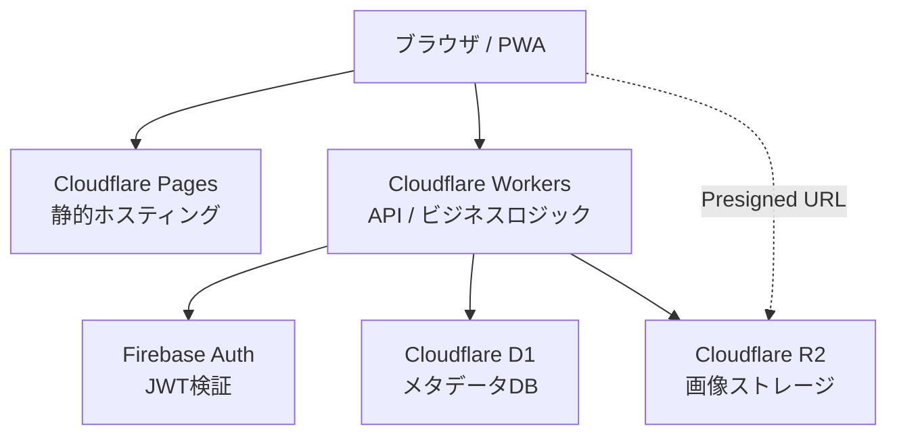
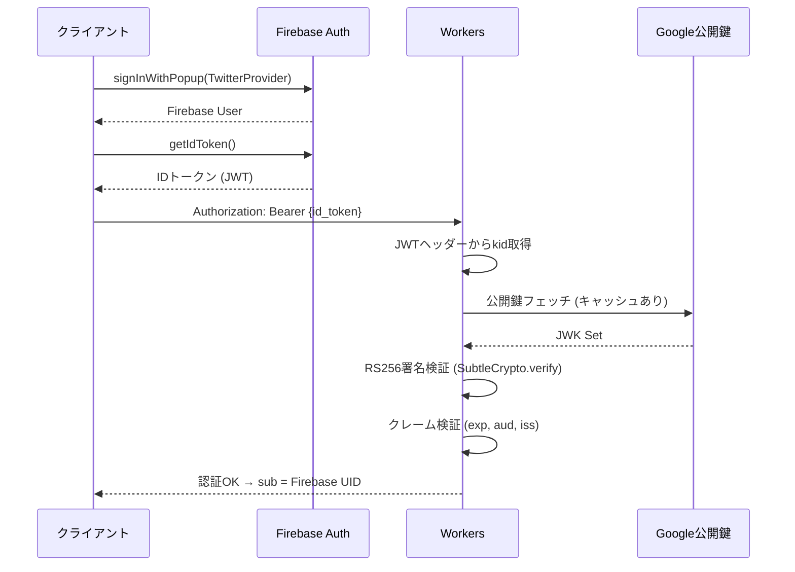
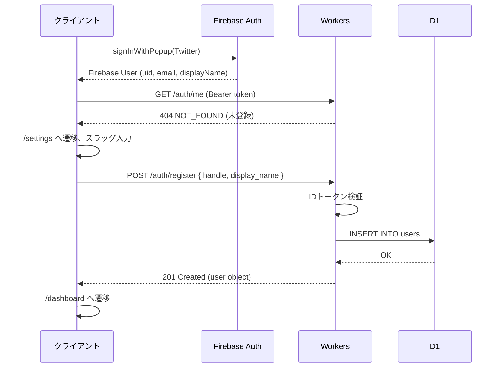
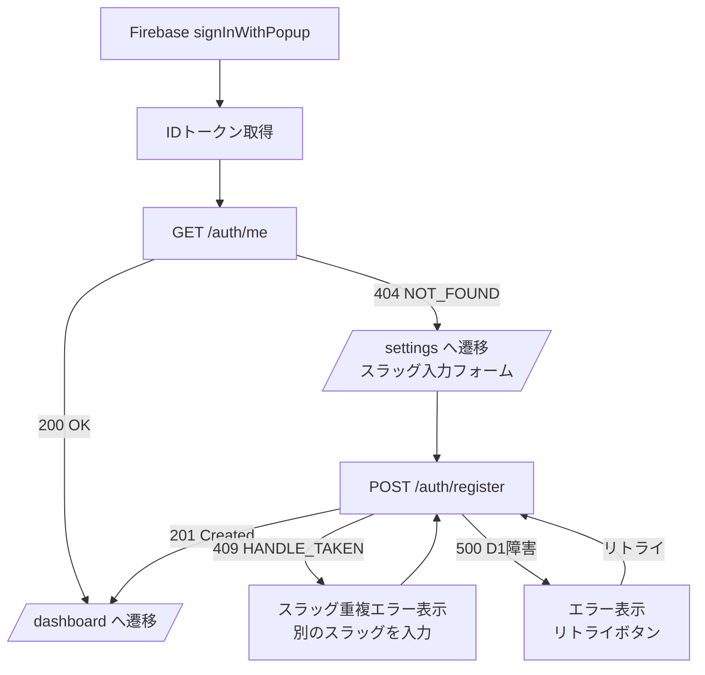
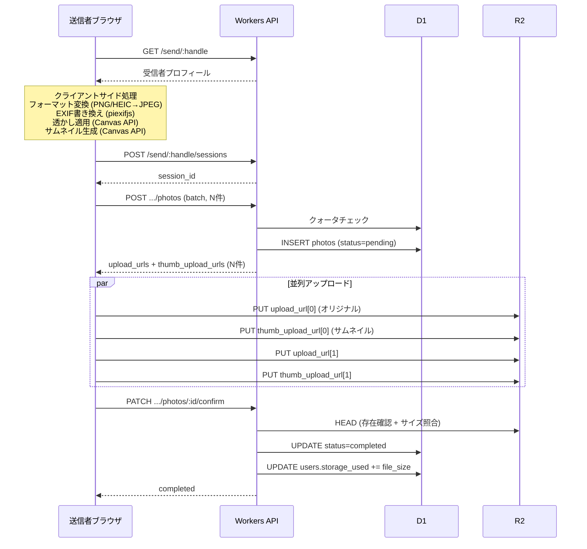

# アーキテクチャ設計書 - FurDrop

## 1. システム構成



### 技術スタック

| レイヤー | 技術 | 理由 |
|---|---|---|
| フロントエンド | React + TypeScript + Vite | PWA対応、開発体験 |
| ホスティング | Cloudflare Pages | 無料、エッジ配信 |
| API | Cloudflare Workers (Hono) | 軽量、R2/D1とネイティブ連携 |
| DB | Cloudflare D1 (SQLite) | 無料枠5GB、エッジ |
| ストレージ | Cloudflare R2 | egress $0が最大の利点 |
| 認証 | Firebase Auth | Twitter OAuth対応、経験あり |
| 状態管理 | Jotai | アトム単位で軽量・シンプル |
| CSS | Tailwind CSS | ユーティリティファースト、最小UIから段階的に改善 |
| E2Eテスト | Playwright | 主要フローの動作検証 |
| PWA | vite-plugin-pwa (Workbox) | Service Worker自動生成 |
| プッシュ通知 | Firebase Cloud Messaging (FCM) | Firebase Auth と統合、PWA対応 |
| インフラ管理 | wrangler.toml + CLI | この規模ではIaC(Terraform等)不要 |

---

## 2. データベース設計 (D1)

### 2.1 users テーブル

受信者アカウント。Firebase Auth UIDをPKとして使用。

```sql
CREATE TABLE users (
    id                TEXT PRIMARY KEY,           -- Firebase Auth UID
    handle            TEXT NOT NULL UNIQUE,        -- 公開URL用スラッグ (例: "taro_camera")
    display_name      TEXT NOT NULL,               -- 表示名
    email             TEXT NOT NULL,               -- Firebase から取得
    avatar_url        TEXT,                        -- プロフィール画像URL
    storage_used      INTEGER NOT NULL DEFAULT 0,  -- 使用バイト数
    storage_quota     INTEGER NOT NULL DEFAULT 10737418240, -- デフォルト10GB
    is_active         INTEGER NOT NULL DEFAULT 1,  -- 0=受付停止, 1=受付中
    -- 受信オプション設定 (R14: 送信者に提示するオプションを制御)
    allow_exif_embed  INTEGER NOT NULL DEFAULT 0,  -- EXIF送信者情報埋め込み許可
    allow_watermark   INTEGER NOT NULL DEFAULT 0,  -- 透かし許可 (不可逆のため慎重に)
    -- プッシュ通知 (R09)
    fcm_token         TEXT,                        -- FCMデバイストークン
    push_enabled      INTEGER NOT NULL DEFAULT 1,  -- 通知ON/OFF
    created_at        INTEGER NOT NULL,            -- UNIX秒
    updated_at        INTEGER NOT NULL             -- UNIX秒
);

CREATE UNIQUE INDEX idx_users_handle ON users(handle);
```

**handle制約**: `^[a-z0-9_]{3,32}$`（小文字英数字とアンダースコア、3-32文字）

### 2.2 upload_sessions テーブル

複数枚アップロードを1セッションにまとめる。

```sql
CREATE TABLE upload_sessions (
    id            TEXT PRIMARY KEY,           -- UUID v4
    receiver_id   TEXT NOT NULL,              -- users.id
    sender_name   TEXT,                       -- 送信者名 (セッション全体)
    photo_count   INTEGER NOT NULL DEFAULT 0, -- 枚数
    total_size    INTEGER NOT NULL DEFAULT 0, -- 合計バイト数
    status        TEXT NOT NULL DEFAULT 'active',
        -- 'active' | 'completed' | 'expired'
    expires_at    INTEGER NOT NULL,           -- UNIX秒 (作成+1時間)
    created_at    INTEGER NOT NULL,
    updated_at    INTEGER NOT NULL
);

CREATE INDEX idx_sessions_receiver ON upload_sessions(receiver_id);
CREATE INDEX idx_sessions_expires ON upload_sessions(expires_at);
```

### 2.3 photos テーブル

```sql
CREATE TABLE photos (
    id                TEXT PRIMARY KEY,       -- UUID v4
    receiver_id       TEXT NOT NULL,          -- users.id
    session_id        TEXT,                   -- upload_sessions.id

    -- R2オブジェクトキー
    r2_key_original   TEXT NOT NULL UNIQUE,
    r2_key_thumb      TEXT NOT NULL UNIQUE,

    -- 送信者メタデータ
    sender_name       TEXT,                   -- 送信者名 / TwitterID
    camera_model      TEXT,                   -- EXIFカメラモデル欄に埋め込んだ送信者情報
    watermark_text    TEXT,                   -- 適用したウォーターマーク (記録用)
    original_filename TEXT,                   -- 元ファイル名

    -- ファイル情報
    file_size         INTEGER NOT NULL,       -- オリジナルのバイト数
    thumb_size        INTEGER NOT NULL DEFAULT 0,
    width             INTEGER,                -- ピクセル幅
    height            INTEGER,                -- ピクセル高さ

    -- ステータス
    upload_status     TEXT NOT NULL DEFAULT 'pending',
        -- 'pending'   : presigned URL発行済み、R2未到達
        -- 'completed' : R2到達確認済み
        -- 'failed'    : タイムアウト

    -- DL期限 (R13)
    expires_at        INTEGER,                -- UNIX秒。NULLの場合はデフォルト(created_at + 30日)

    created_at        INTEGER NOT NULL,
    updated_at        INTEGER NOT NULL
);

CREATE INDEX idx_photos_receiver ON photos(receiver_id, created_at DESC);
CREATE INDEX idx_photos_session ON photos(session_id);
CREATE INDEX idx_photos_status ON photos(receiver_id, upload_status);
CREATE INDEX idx_photos_expires ON photos(expires_at);
```

### 2.4 クォータ管理

アトミックなUPDATEでクォータ超過を防止:

```sql
-- アップロード確定時
UPDATE users
SET storage_used = storage_used + :file_size,
    updated_at   = :now
WHERE id = :receiver_id
  AND storage_used + :file_size <= storage_quota;
-- affected rows = 0 → 容量超過エラー (HTTP 507)
```

チェックは2段階:
1. Presigned URL発行時（楽観的チェック）
2. confirm時のUPDATE（確定的チェック）

---

## 3. R2 ストレージ設計

### 3.1 バケット構成

| バケット名 | 用途 | アクセス |
|---|---|---|
| `furdrop-originals` | オリジナル画像 (~10MB/枚) | プライベート |
| `furdrop-thumbs` | サムネイル (~50KB/枚) | プライベート |

### 3.2 オブジェクトキー

```
furdrop-originals/
  {receiver_handle}/{YYYY-MM}/{photo_id}.jpg

furdrop-thumbs/
  {receiver_handle}/{YYYY-MM}/{photo_id}_thumb.jpg
```

- `receiver_handle`: 受信者ごとの分離
- `YYYY-MM`: 月単位整理（将来のライフサイクル管理用）
- `photo_id` (UUID v4): 衝突ゼロ、URL推測不可能

### 3.3 Presigned URL戦略

全てのR2アクセスはPresigned URL経由。クライアントがR2に直接PUT/GETする。

| 用途 | HTTP | 有効期限 | 制約 |
|---|---|---|---|
| オリジナルアップロード | PUT | 15分 | Content-Type: image/jpeg, Content-Length制限 |
| サムネイルアップロード | PUT | 15分 | Content-Type: image/jpeg, 最大500KB |
| サムネイル表示 | GET | 60分 | - |
| オリジナルDL | GET | 60分 | - |

Workers内で `@aws-sdk/s3-request-presigner` を使ってPresigned URLを生成する。

---

## 4. API設計 (Cloudflare Workers)

### 4.1 共通仕様

```
Base URL: https://api.furdrop.example.com
Content-Type: application/json

認証ヘッダー（受信者エンドポイントのみ）:
  Authorization: Bearer {Firebase_ID_Token}

エラーレスポンス:
{
  "error": {
    "code": "QUOTA_EXCEEDED",
    "message": "ストレージ容量を超過しています"
  }
}
```

### 4.2 エラーコード

| HTTP | code | 説明 |
|---|---|---|
| 400 | INVALID_REQUEST | バリデーション失敗 |
| 401 | UNAUTHORIZED | トークンなし/期限切れ |
| 403 | FORBIDDEN | 権限なし |
| 404 | NOT_FOUND | リソース不在 |
| 409 | HANDLE_TAKEN | handle使用済み |
| 413 | FILE_TOO_LARGE | ファイルサイズ超過 |
| 415 | INVALID_FORMAT | 画像フォーマット不正（X10: マジックバイト検証失敗） |
| 429 | RATE_LIMITED | レート制限 |
| 507 | QUOTA_EXCEEDED | ストレージクォータ超過 |

### 4.3 受信者向けエンドポイント（認証必須）

#### POST /auth/register

新規受信者登録。

```
Request:
{
  "handle": "taro_camera",
  "display_name": "太郎カメラ"
}

Response: 201
{
  "user": {
    "id": "firebase-uid-xxx",
    "handle": "taro_camera",
    "display_name": "太郎カメラ",
    "storage_used": 0,
    "storage_quota": 10737418240,
    "receive_url": "https://furdrop.example.com/send/taro_camera"
  }
}
```

#### GET /auth/me

自分の情報取得。

```
Response: 200
{
  "user": { ... }  // register同様の形式
}
```

#### GET /receiver/photos

受信写真一覧（カーソルベースページネーション）。

```
Query: ?limit=50&cursor=xxx

Response: 200
{
  "photos": [
    {
      "id": "uuid",
      "sender_name": "@hanako_photo",
      "camera_model": "@hanako_photo",
      "original_filename": "IMG_0042.JPG",
      "file_size": 9437184,
      "width": 6000,
      "height": 4000,
      "thumb_url": "https://...presigned...",
      "created_at": 1744243200
    }
  ],
  "next_cursor": "eyJpZCI6..."
}
```

`thumb_url` はWorkers内でPresigned GETを生成して返す。

#### GET /receiver/photos/:photoId/download

オリジナルDL用Presigned URL発行。

```
Response: 200
{
  "download_url": "https://...presigned...",
  "filename": "IMG_0042.JPG",
  "file_size": 9437184
}
```

#### DELETE /receiver/photos/:photoId

写真削除。R2オブジェクト削除 + D1レコード削除 + storage_used減算。

```
Response: 204 No Content
```

#### DELETE /receiver/photos (Batch)

一括削除。

```
Request:
{ "photo_ids": ["uuid1", "uuid2"] }

Response: 200
{ "deleted_count": 2 }
```

#### GET /receiver/quota

```
Response: 200
{
  "storage_used": 2147483648,
  "storage_quota": 10737418240,
  "usage_percent": 20.0,
  "photo_count": 215
}
```

### 4.4 送信者向けエンドポイント（認証不要）

#### GET /send/:handle

受信者の公開プロフィール取得。

```
Response: 200
{
  "receiver": {
    "handle": "taro_camera",
    "display_name": "太郎カメラ",
    "avatar_url": "https://...",
    "is_accepting": true,
    "options": {
      "allow_exif_embed": false,
      "allow_watermark": false
    }
  }
}
```

- `is_accepting` が false、またはクォータ超過時はアップロードUI非表示
- `options`: 受信者が許可した送信者オプション（R14）。送信者UIはこれに基づいて表示を切替

#### POST /send/:handle/sessions

アップロードセッション開始。`photo_count` は最大100枚。

```
Request:
{
  "sender_name": "@hanako_photo",
  "photo_count": 3
}

Response: 201
{
  "session_id": "uuid",
  "expires_at": 1744246800
}
```

#### POST /send/:handle/sessions/:sessionId/photos

1枚分のPresigned URL取得（バッチ対応）。

```
Request:
{
  "photos": [
    {
      "filename": "IMG_0042.JPG",
      "file_size": 9437184,
      "width": 6000,
      "height": 4000,
      "camera_model": "@hanako_photo",
      "watermark_text": "#FurDrop"
    }
  ]
}

Response: 201
{
  "uploads": [
    {
      "photo_id": "uuid",
      "upload_url": "https://r2...presigned-put...",
      "thumb_upload_url": "https://r2...presigned-put..."
    }
  ],
  "expires_in": 900
}
```

#### PATCH /send/:handle/sessions/:sessionId/photos/:photoId/confirm

R2アップロード完了確認。Workers側でR2 HEADリクエストして存在確認。

```
Request:
{ "thumb_size": 28672 }

Response: 200
{
  "photo_id": "uuid",
  "upload_status": "completed"
}
```

#### GET /send/:handle/sessions/:sessionId

セッション内写真一覧（送信完了画面用）。セッション期限後は404。

```
Response: 200
{
  "session_id": "uuid",
  "photos": [
    {
      "photo_id": "uuid",
      "thumb_url": "https://...presigned...",
      "filename": "IMG_0042.JPG",
      "status": "completed"
    }
  ]
}
```

---

## 5. 認証フロー

### 5.1 Firebase IDトークン検証（Workers）

Cloudflare WorkersにはFirebase Admin SDKが動作しないため、Web Crypto APIで直接検証する。



**クレーム検証:**
- `exp > now` (有効期限)
- `aud == FIREBASE_PROJECT_ID`
- `iss == "https://securetoken.google.com/{PROJECT_ID}"`

公開鍵はCloudflare Cache APIでキャッシュし、リクエストごとのGoogle外部フェッチを回避。

### 5.2 新規登録フロー



### 5.2.1 登録失敗時のリカバリ

Firebase Auth成功後にD1 INSERTが失敗するケースへの対処。



**設計ポイント:**
- Firebase AuthとD1は別システムなので分散トランザクションは行わない
- Firebase Authが成功してD1が失敗しても、次回ログイン時に `GET /auth/me → 404` で登録画面に誘導される（自然なリカバリ）
- `POST /auth/register` はUID重複時に既存レコードを返す（べき等性を確保）
- handle重複（409）はユーザーに別のスラッグ選択を促す
- D1一時障害（500）はリトライボタンで再試行

### 5.3 アクセス制御マトリクス

| エンドポイント | 認証 | 認可ルール |
|---|---|---|
| GET /send/:handle | 不要 | handleが存在 |
| POST /send/:handle/sessions | 不要 | handle存在 + is_active + クォータ未超過 |
| POST .../photos | 不要 | sessionがそのhandleに属する |
| PATCH .../confirm | 不要 | photoがそのsessionに属する |
| POST /auth/register | Firebase必須 | UID未登録 |
| GET /auth/me | Firebase必須 | - |
| GET /receiver/* | Firebase必須 | receiver_id == 認証UID |
| DELETE /receiver/* | Firebase必須 | receiver_id == 認証UID |

---

## 6. アップロードフロー（シーケンス）



### サーバー側ファイルサイズ検証

Presigned URLのバイパスによる巨大ファイルアップロードを防止:

1. **Presigned URL署名時**: `Content-Length: {申告サイズ}` を署名に含める → 異なるサイズのPUTはR2が `SignatureDoesNotMatch` で拒否
2. **confirm時**: R2 HEADで実際のオブジェクトサイズを取得し、D1の `file_size` と照合。不一致の場合はR2オブジェクト削除 + エラー返却

---

## 7. クリーンアップジョブ (Cron Trigger)

`wrangler.toml` で毎時0分に実行:

```toml
[[triggers]]
crons = ["0 * * * *"]
```

処理内容:
1. `upload_status = 'pending'` かつ `created_at < now - 1hour` → `'failed'` に更新
2. `expires_at < now` の `upload_sessions` → `'expired'` に更新
3. `'failed'` 写真のR2オブジェクトが存在すれば削除（ゴミ回収）
4. **DL期限切れ写真の自動削除 (X11/R13)**: `expires_at < now`（またはデフォルト `created_at + 30日 < now`）の `completed` 写真 → R2オブジェクト削除 + D1レコード削除 + `storage_used` 減算

---

## 8. プロジェクト構成

```
furdrop/
  frontend/                   # Cloudflare Pages (PWA)
    src/
      components/             # UIコンポーネント (Tailwind CSS)
      pages/                  # ページコンポーネント
      hooks/                  # カスタムフック
      lib/
        image-processing.ts   # EXIF書換・透かし・サムネイル・フォーマット変換
        firebase.ts           # Firebase Auth初期化
        api.ts                # Workers APIクライアント
      stores/                 # Jotaiアトム
      App.tsx
      main.tsx
    public/
      manifest.json
    vite.config.ts
    tailwind.config.ts

  workers/                    # Cloudflare Workers (API)
    src/
      index.ts                # エントリポイント (Hono)
      routes/
        auth.ts               # POST /auth/register, GET /auth/me
        receiver.ts           # GET/DELETE /receiver/*
        sender.ts             # GET/POST /send/:handle/*
      lib/
        firebase-auth.ts      # Firebase IDトークン検証
        r2.ts                 # Presigned URL生成
        quota.ts              # クォータチェック・更新
      middleware/
        auth.ts               # 認証ミドルウェア
      types.ts                # Env, Bindings型定義
    migrations/
      0001_initial.sql        # 初期スキーマ
    wrangler.toml

  e2e/                        # Playwrightテスト
    tests/
      sender-upload.spec.ts   # 送信者アップロードフロー
      receiver-gallery.spec.ts # 受信者ギャラリー・DLフロー
      auth.spec.ts            # 認証フロー
    playwright.config.ts

  docs/                       # 設計ドキュメント
```

### 設定ファイル生成

`wrangler.toml` やフロントエンドの `.env.local` はテンプレートから自動生成する。リソースIDなどをpublic repoにコミットしないため。

```
.env                             ← dotenvxで暗号化してコミット（全環境変数を一元管理）
.env.keys                        ← gitignore（復号キー）
workers/wrangler.template.toml   ← コミット対象（プレースホルダ）
workers/.dev.template.vars       ← コミット対象（プレースホルダ）
frontend/.env.template.local     ← コミット対象（プレースホルダ）
workers/wrangler.toml            ← gitignore（自動生成）
workers/.dev.vars                ← gitignore（自動生成）
frontend/.env.local              ← gitignore（自動生成）
```

```bash
# 設定ファイルを生成 (workers + frontend)
pnpm generate

# workers の dev/deploy は自動で generate を実行する
pnpm --filter workers dev
```

`pnpm generate` は `workers/` と `frontend/` 内の全 `*.template.*` ファイルを検索し、
`{{VAR_NAME}}` プレースホルダをルート `.env` の値で置換して対応するファイルを生成する。

新しい変数を追加する場合:

```bash
# 1. ルートの .env に暗号化して追加
pnpm exec dotenvx set KEY value

# 2. 対応するテンプレートにプレースホルダを追加
# wrangler.template.toml: database_id = "{{KEY}}"
# .env.template.local:    VITE_KEY={{VITE_KEY}}
```

### 秘密情報管理

全ての設定値はルートの `.env` にdotenvxで暗号化して一元管理する。
ローカル開発用のファイルは `pnpm generate` で自動生成される。
本番デプロイ時は `wrangler secret put` でCloudflare側にも設定が必要。

| 環境 | 方式 | ファイル |
|---|---|---|
| 設定一元管理 | dotenvx暗号化 | `.env` (暗号化コミット) |
| ローカル開発 (Workers) | テンプレートから自動生成 | `.dev.vars`, `wrangler.toml` (gitignore対象) |
| ローカル開発 (Frontend) | テンプレートから自動生成 | `.env.local` (gitignore対象) |
| 本番 (Workers) | `wrangler secret put` | Cloudflareで暗号化管理 |

**秘密情報一覧:**

| 変数名 | 用途 | 管理方法 |
|---|---|---|
| `D1_DATABASE_ID` | D1データベース識別子 | dotenvx → wrangler.toml |
| `R2_ACCESS_KEY_ID` | R2 Presigned URL署名 | dotenvx → .dev.vars / wrangler secret |
| `R2_SECRET_ACCESS_KEY` | R2 Presigned URL署名 | dotenvx → .dev.vars / wrangler secret |
| `R2_ENDPOINT` | R2 S3互換APIエンドポイント | dotenvx → .dev.vars / wrangler secret |
| `FIREBASE_PROJECT_ID` | IDトークン検証 | wrangler.toml [vars]（非秘密） |
| `VITE_FIREBASE_API_KEY` | Firebase SDK初期化 | .env.local（公開可、ドメイン制限で保護） |
| `VITE_FIREBASE_AUTH_DOMAIN` | Firebase SDK初期化 | .env.local（公開可） |
