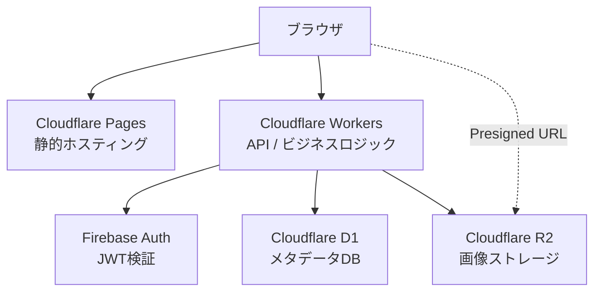
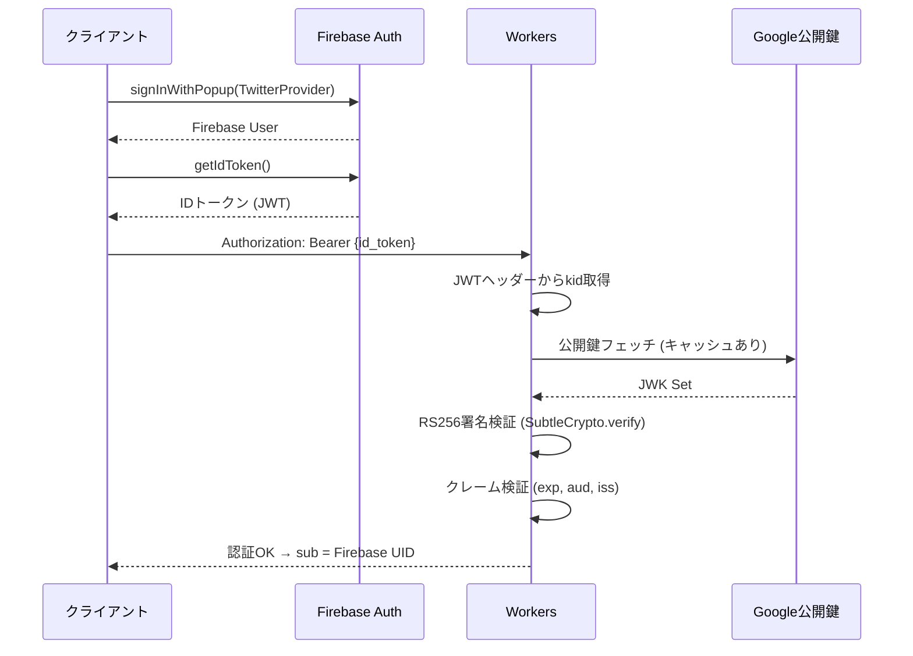
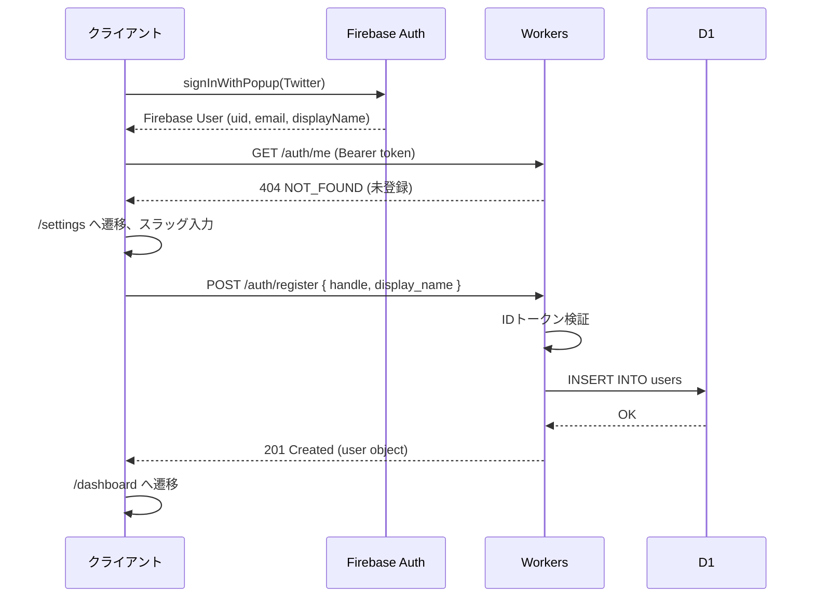
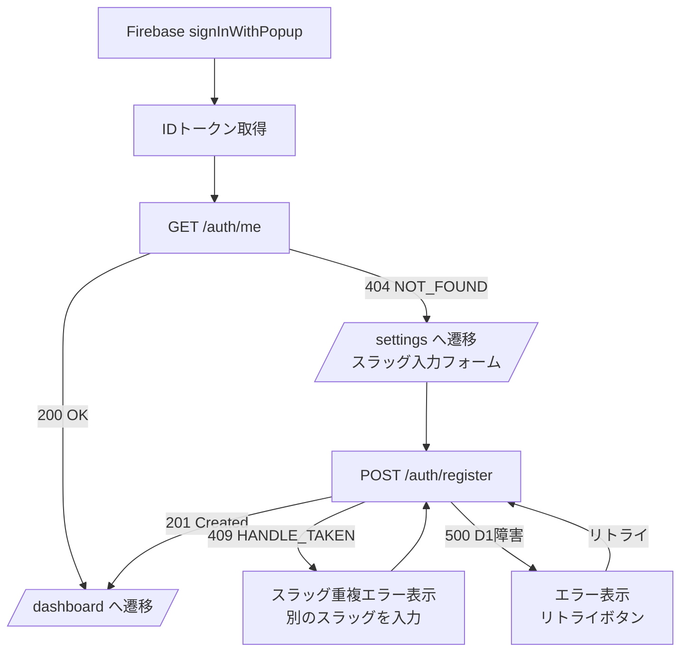
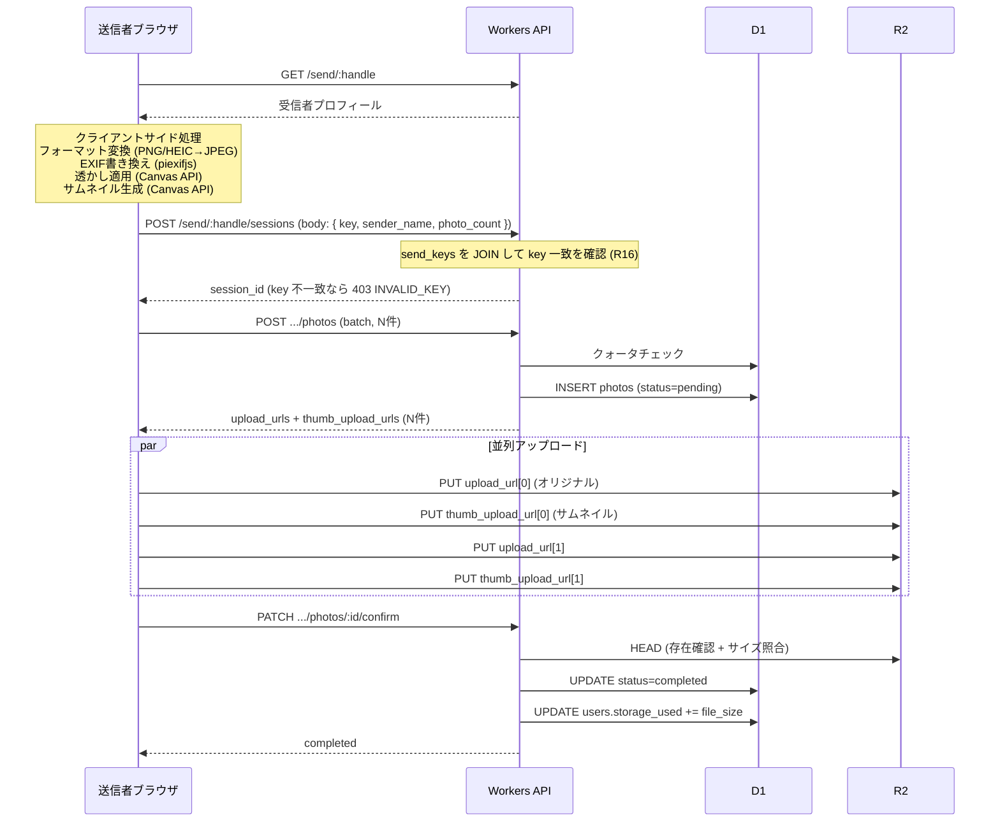

# アーキテクチャ設計書 - FurDrop

## 1. システム構成


```mermaid
graph TD
    Browser[ブラウザ]
    Browser --> Pages[Cloudflare Pages<br/>静的ホスティング]
    Browser --> Workers[Cloudflare Workers<br/>API / ビジネスロジック]
    Workers --> Firebase[Firebase Auth<br/>JWT検証]
    Workers --> D1[Cloudflare D1<br/>メタデータDB]
    Workers --> R2[Cloudflare R2<br/>画像ストレージ]
    Browser -.->|Presigned URL| R2
```

### 技術スタック

| レイヤー | 技術 | 理由 |
|---|---|---|
| フロントエンド | React + TypeScript + Vite | 開発体験（PWA 化は Phase 2） |
| ホスティング | Cloudflare Pages | 無料、エッジ配信 |
| API | Cloudflare Workers (Hono) | 軽量、R2/D1とネイティブ連携 |
| DB | Cloudflare D1 (SQLite) | 無料枠5GB、エッジ |
| ストレージ | Cloudflare R2 | egress $0が最大の利点 |
| 認証 | Firebase Auth | Twitter OAuth対応、経験あり |
| 状態管理 | Jotai | アトム単位で軽量・シンプル |
| CSS | Tailwind CSS | ユーティリティファースト、最小UIから段階的に改善 |
| E2Eテスト | Playwright | 主要フローの動作検証 |
| PWA | vite-plugin-pwa (Workbox)（**Phase 2**） | Service Worker 自動生成。MVP では未導入 |
| プッシュ通知 | Firebase Cloud Messaging (FCM)（**Phase 2**） | Firebase Auth と統合、PWA対応。MVP では未導入 |
| インフラ管理 | wrangler.toml + CLI | この規模ではIaC(Terraform等)不要 |

---

## 2. データベース設計 (D1)

### 2.1 users テーブル

受信者アカウント。Firebase Auth UIDをPKとして使用。

```sql
CREATE TABLE users (
    id                TEXT PRIMARY KEY,           -- Firebase Auth UID
    handle            TEXT NOT NULL UNIQUE,        -- 公開URL用スラッグ (例: "taro_camera")
    display_name      TEXT NOT NULL,               -- 表示名
    email             TEXT NOT NULL,               -- Firebase から取得
    avatar_url        TEXT,                        -- プロフィール画像URL
    storage_used      INTEGER NOT NULL DEFAULT 0,  -- 使用バイト数
    storage_quota     INTEGER NOT NULL DEFAULT 10737418240, -- デフォルト10GB
    is_active         INTEGER NOT NULL DEFAULT 1,  -- 0=受付停止, 1=受付中
    -- 受信オプション設定 (R14: 送信者に提示するオプションを制御)
    -- 'disabled' | 'optional' | 'required' の3値。
    -- 'required' は送信者に必ず埋め込みを行わせる(サーバ側でも必須検証)
    exif_embed_mode   TEXT NOT NULL DEFAULT 'disabled',
    watermark_mode    TEXT NOT NULL DEFAULT 'disabled',  -- 透かしは不可逆のため慎重に
    require_sender_name INTEGER NOT NULL DEFAULT 0,      -- 送信者名の入力を必須にする (0=任意, 1=必須)
    -- プッシュ通知 (R09): Phase 2 で導入予定。MVP の DB スキーマには含めない
    -- fcm_token         TEXT,
    -- push_enabled      INTEGER NOT NULL DEFAULT 1,
    created_at        INTEGER NOT NULL,            -- UNIX秒
    updated_at        INTEGER NOT NULL             -- UNIX秒
);

CREATE UNIQUE INDEX idx_users_handle ON users(handle);
```

**handle制約**: `^[a-z0-9_]{3,32}$`（小文字英数字とアンダースコア、3-32文字）

### 2.2 send_keys テーブル (R16)

受信URL `https://domain/send/:handle?k=KEY` のアクセスキーを格納する。1 受信者 : N キー。

```sql
CREATE TABLE send_keys (
    id            TEXT PRIMARY KEY,           -- UUID v4
    receiver_id   TEXT NOT NULL REFERENCES users(id),
    key_value     TEXT NOT NULL UNIQUE,        -- URL-safe な乱数 (生成方式は下記)
    created_at    INTEGER NOT NULL,            -- UNIX秒
    updated_at    INTEGER NOT NULL             -- UNIX秒
);

CREATE INDEX idx_send_keys_receiver ON send_keys(receiver_id);
```

- **生成**: 新規発行は Workers の `generateSendKey()` (`crypto.getRandomValues` + URL-safe 64 文字、デフォルト 21 文字 = 126 bit のエントロピー、nanoid と同等)。既存ユーザーへの初期発行 (`0007_send_keys.sql` マイグレーション内) では SQLite の `lower(hex(randomblob(16)))` で 128 bit の HEX 文字列を生成
- **保存**: 平文。URL に乗せて配布する性質なのでハッシュ化のセキュリティ効果は限定的で、UI で「現在のキーをそのまま表示」できる UX を優先
- **無効化**: レコードの DELETE で表現 (`is_active` カラムは現状不要)
- **拡張性**: 将来必要になれば `expires_at` / `name` / `is_active` を ALTER で追加する。MVP では発行・削除のみ
- **MVP の UI**: キー管理画面は提供しない。`POST /auth/register` でユーザー作成時に 1 件自動発行、`GET /auth/me` / `PATCH /auth/options` で最古のキー 1 件を `receive_url` に結合して返すのみ
- **アカウント削除**: `DELETE /auth/account` の batch で同期削除 (`DELETE FROM send_keys WHERE receiver_id = ?`)。upload_sessions のような「孤児」になるケースはないため専用 Cron 不要

### 2.3 upload_sessions テーブル

複数枚アップロードを1セッションにまとめる。

```sql
CREATE TABLE upload_sessions (
    id            TEXT PRIMARY KEY,           -- UUID v4
    receiver_id   TEXT NOT NULL,              -- users.id
    sender_name   TEXT,                       -- 送信者名 (セッション全体)
    photo_count   INTEGER NOT NULL DEFAULT 0, -- 枚数
    total_size    INTEGER NOT NULL DEFAULT 0, -- 合計バイト数
    status        TEXT NOT NULL DEFAULT 'active',
        -- 'active' | 'completed' | 'expired'
    expires_at    INTEGER NOT NULL,           -- UNIX秒 (作成+1時間)
    -- 発信者情報開示請求対応用の通信記録 (情プラ法5条)。
    -- Cron Trigger で created_at から100日経過後に NULL クリアされる (利用規約・プライバシーポリシーで「最低3か月」を保証)。
    sender_ip     TEXT,                       -- CF-Connecting-IP
    sender_ua     TEXT,                       -- User-Agent
    created_at    INTEGER NOT NULL,
    updated_at    INTEGER NOT NULL
);

CREATE INDEX idx_sessions_receiver ON upload_sessions(receiver_id);
CREATE INDEX idx_sessions_expires ON upload_sessions(expires_at);
```

### 2.4 photos テーブル

```sql
CREATE TABLE photos (
    id                TEXT PRIMARY KEY,       -- UUID v4
    receiver_id       TEXT NOT NULL,          -- users.id
    session_id        TEXT,                   -- upload_sessions.id

    -- R2オブジェクトキー
    r2_key_original   TEXT NOT NULL UNIQUE,
    r2_key_thumb      TEXT NOT NULL UNIQUE,

    -- 送信者メタデータ
    sender_name       TEXT,                   -- 送信者名 / TwitterID
    camera_model      TEXT,                   -- EXIFカメラモデル欄に埋め込んだ送信者情報
    watermark_text    TEXT,                   -- 適用したウォーターマーク (記録用)。要素配列を serialize した JSON 文字列 ({"v":1,"elements":[...]})
    original_filename TEXT,                   -- 元ファイル名

    -- ファイル情報
    file_size         INTEGER NOT NULL,       -- オリジナルのバイト数
    thumb_size        INTEGER NOT NULL DEFAULT 0,
    width             INTEGER,                -- ピクセル幅
    height            INTEGER,                -- ピクセル高さ

    -- ステータス
    upload_status     TEXT NOT NULL DEFAULT 'pending',
        -- 'pending'   : presigned URL発行済み、R2未到達
        -- 'completed' : R2到達確認済み
        -- 'failed'    : タイムアウト

    -- DL期限 (R13)
    expires_at        INTEGER,                -- UNIX秒。NULLの場合はデフォルト(created_at + 30日)

    -- 同一 created_at (秒精度) 内の送信順を保持するための tiebreak
    batch_index       INTEGER NOT NULL DEFAULT 0,

    created_at        INTEGER NOT NULL,
    updated_at        INTEGER NOT NULL
);

-- ギャラリー並び順: ORDER BY created_at DESC, batch_index ASC, id DESC
CREATE INDEX idx_photos_receiver ON photos(receiver_id, created_at DESC);
CREATE INDEX idx_photos_session ON photos(session_id);
CREATE INDEX idx_photos_status ON photos(receiver_id, upload_status);
CREATE INDEX idx_photos_expires ON photos(expires_at);
```

### 2.5 クォータ管理

アトミックなUPDATEでクォータ超過を防止:

```sql
-- アップロード確定時
UPDATE users
SET storage_used = storage_used + :file_size,
    updated_at   = :now
WHERE id = :receiver_id
  AND storage_used + :file_size <= storage_quota;
-- affected rows = 0 → 容量超過エラー (HTTP 507)
```

チェックは2段階:
1. Presigned URL発行時（楽観的チェック）
2. confirm時のUPDATE（確定的チェック）

---

## 3. R2 ストレージ設計

### 3.1 バケット構成

| バケット名 | 用途 | アクセス |
|---|---|---|
| `furdrop-originals` | オリジナル画像 (~10MB/枚) | プライベート |
| `furdrop-thumbs` | サムネイル (~50KB/枚) | プライベート |

### 3.2 オブジェクトキー

```
furdrop-originals/
  {receiver_handle}/{YYYY-MM}/{photo_id}.jpg

furdrop-thumbs/
  {receiver_handle}/{YYYY-MM}/{photo_id}_thumb.jpg
```

- `receiver_handle`: 受信者ごとの分離
- `YYYY-MM`: 月単位整理（将来のライフサイクル管理用）
- `photo_id` (UUID v4): 衝突ゼロ、URL推測不可能

### 3.3 Presigned URL戦略

全てのR2アクセスはPresigned URL経由。クライアントがR2に直接PUT/GETする。

| 用途 | HTTP | 有効期限 | 制約 |
|---|---|---|---|
| オリジナルアップロード | PUT | 15分 | Content-Type: image/jpeg, Content-Length制限 |
| サムネイルアップロード | PUT | 15分 | Content-Type: image/jpeg, 最大500KB |
| サムネイル表示 | GET | 60分 | - |
| オリジナルDL | GET | 60分 | - |

Workers内で `@aws-sdk/s3-request-presigner` を使ってPresigned URLを生成する。

---

## 4. API設計 (Cloudflare Workers)

### 4.1 共通仕様

```
Base URL: https://api.furdrop.example.com
Content-Type: application/json

認証ヘッダー（受信者エンドポイントのみ）:
  Authorization: Bearer {Firebase_ID_Token}

エラーレスポンス:
{
  "error": {
    "code": "QUOTA_EXCEEDED",
    "message": "ストレージ容量を超過しています"
  }
}

セキュリティヘッダ（全レスポンス共通）:
  X-Frame-Options: DENY
  Content-Security-Policy: frame-ancestors 'none'
  Referrer-Policy: strict-origin-when-cross-origin
  X-Content-Type-Options: nosniff
  Strict-Transport-Security: max-age=31536000; includeSubDomains
```

### レート制限 (X05)

匿名送信フローを濫用から保護するため、Cloudflare Workers Rate Limiting binding で送信者IP単位の制限を適用する。

| エンドポイント | 制限 | 超過時 |
|---|---|---|
| `POST /send/:handle/sessions` | 5 / 60秒 / IP | 429 + `Retry-After: 60` |
| `POST /send/:handle/sessions/:id/photos` | 30 / 60秒 / IP | 429 + `Retry-After: 60` |
| その他 GET 系 | 制限なし | — |

キーは `CF-Connecting-IP` を使用。Cloudflare Rate Limiting binding は 10秒/60秒窓のみ対応のため、原案の「30/h・300/h」は 60秒窓に圧縮して実装。

### 4.2 エラーコード

| HTTP | code | 説明 |
|---|---|---|
| 400 | INVALID_REQUEST | バリデーション失敗 (zod の失敗も `lib/schema.ts` の `defaultHook` でこの形式に揃える) |
| 401 | UNAUTHORIZED | トークンなし/期限切れ |
| 403 | FORBIDDEN | 権限なし |
| 403 | INVALID_KEY | 送信URLのアクセスキー (R16) が不一致 |
| 404 | NOT_FOUND | リソース不在 |
| 409 | HANDLE_TAKEN | handle使用済み |
| 413 | FILE_TOO_LARGE | ファイルサイズ超過 |
| 415 | INVALID_FORMAT | 画像フォーマット不正（X10: マジックバイト検証失敗） |
| 429 | RATE_LIMITED | レート制限 |
| 500 | INTERNAL | 未捕捉例外 (app.onError が構造化して返却・Workers Logs に記録) |
| 507 | QUOTA_EXCEEDED | ストレージクォータ超過 |

### 4.3 受信者向けエンドポイント（認証必須）

#### POST /auth/register

新規受信者登録。

```
Request:
{
  "handle": "taro_camera",
  "display_name": "太郎カメラ"
}

Response: 201
{
  "user": {
    "id": "firebase-uid-xxx",
    "handle": "taro_camera",
    "display_name": "太郎カメラ",
    "storage_used": 0,
    "storage_quota": 10737418240,
    "receive_url": "/send/taro_camera?k=V1StGXR8_Z5jdHi6B-myT"
  }
}
```

`receive_url` には初期発行された送信URLアクセスキー (R16) が `?k=` 付きで含まれる。フロントは `window.location.origin + receive_url` で完全 URL に組み立てる。

#### GET /auth/me

自分の情報取得。

```
Response: 200
{
  "user": { ... }  // register同様の形式 — receive_url には最古の send_keys.key_value が ?k= 付きで含まれる
}
```

#### DELETE /auth/account

受信者アカウント削除（R15）。自身の `photos` / `upload_sessions` / `users` レコードを D1 から削除し、R2 のオリジナル/サムネイルオブジェクトを背景タスクで削除する。

クライアントは API 呼び出し成功後に Firebase Web SDK の `deleteUser()` を best-effort で実行する。Workers 側では Firebase Admin SDK が利用できないため Firebase Auth ユーザーの削除はサーバから実行できない。

```
Request:
{ "confirm_handle": "taro_camera" }   // 自身のハンドルを再入力（誤操作防止）

Response: 204 No Content

エラー:
- 400 INVALID_REQUEST: confirm_handle が一致しない
- 404 NOT_FOUND: ユーザー未登録
```

実装上のポイント:
- 削除前に `photos.r2_key_original` / `r2_key_thumb` を全件 SELECT
- D1 は `batch()` で 順序保証して以下を実行:
  - `DELETE FROM photos WHERE receiver_id = ?` — 全件
  - `DELETE FROM send_keys WHERE receiver_id = ?` — 全件 (R16)
  - `DELETE FROM upload_sessions WHERE receiver_id = ? AND created_at < (now - 100日)` — **保存期間 (利用規約第13条 = 最低3か月) 経過済みのみ**。保存期間中のセッションは `sender_ip` / `sender_ua` を保護するため保持する
  - `DELETE FROM users WHERE id = ?`
- R2 削除は `ctx.waitUntil(Promise.allSettled(...))` で背景実行し、レスポンスを早く返す
- Workers のサブリクエスト上限（Paid plan: 1000/invocation）を超える場合は残分が孤立オブジェクトとして残るが、ユーザー削除は頻度が低く許容する
- 保存期間中の理由で残された「孤児セッション」(`receiver_id` が users に存在しない) は Cron `cleanupOrphanedSessions` が 100日経過後に物理削除する

#### GET /receiver/photos

受信写真一覧（カーソルベースページネーション）。

```
Query: ?limit=50&cursor=xxx

Response: 200
{
  "photos": [
    {
      "id": "uuid",
      "sender_name": "@hanako_photo",
      "camera_model": "@hanako_photo",
      "original_filename": "IMG_0042.JPG",
      "file_size": 9437184,
      "width": 6000,
      "height": 4000,
      "thumb_url": "https://...presigned...",
      "created_at": 1744243200
    }
  ],
  "next_cursor": "eyJpZCI6..."
}
```

`thumb_url` はWorkers内でPresigned GETを生成して返す。

#### GET /receiver/photos/:photoId/download

オリジナルDL用Presigned URL発行。

```
Response: 200
{
  "download_url": "https://...presigned...",
  "filename": "IMG_0042.JPG",
  "file_size": 9437184
}
```

#### DELETE /receiver/photos/:photoId

写真削除。R2オブジェクト削除 + D1レコード削除 + storage_used減算。

```
Response: 204 No Content
```

#### DELETE /receiver/photos (Batch)

一括削除。

```
Request:
{ "photo_ids": ["uuid1", "uuid2"] }

Response: 200
{ "deleted_count": 2 }
```

#### GET /receiver/quota

```
Response: 200
{
  "storage_used": 2147483648,
  "storage_quota": 10737418240,
  "usage_percent": 20.0,
  "photo_count": 215
}
```

### 4.4 送信者向けエンドポイント（認証不要）

#### GET /send/:handle

受信者の公開プロフィール取得。

```
Response: 200
{
  "receiver": {
    "handle": "taro_camera",
    "display_name": "太郎カメラ",
    "avatar_url": "https://...",
    "is_accepting": true,
    "options": {
      "exif_embed_mode": "optional",
      "watermark_mode": "disabled",
      "require_sender_name": false
    }
  }
}
```

- `is_accepting` が false、またはクォータ超過時はアップロードUI非表示
- `options`: 受信者の埋め込み制御モード（R14）。`'disabled' | 'optional' | 'required'` の3値。
  - `disabled`: 送信者UIに表示しない
  - `optional`: 送信者が任意で選択
  - `required`: 送信者は必ず埋め込み (UIで強制ON、サーバ側でも未指定時は400)

#### POST /send/:handle/sessions

アップロードセッション開始。`photo_count` は最大100枚。

`key` は受信URL `?k=` のアクセスキー (R16)。`send_keys.key_value` と一致しない場合は `403 INVALID_KEY` を返す。

```
Request:
{
  "key": "V1StGXR8_Z5jdHi6B-myT",
  "sender_name": "@hanako_photo",
  "photo_count": 3
}

Response: 201
{
  "session_id": "uuid",
  "expires_at": 1744246800
}

エラー:
- 400 INVALID_REQUEST: 受信者が送信者名必須 (require_sender_name=1) なのに sender_name 未指定
- 403 INVALID_KEY: key が受信者のいずれのキーとも一致しない
- 403 FORBIDDEN: 受信者が受付停止中 (is_active=0)
- 507 QUOTA_EXCEEDED: 受信者のクォータ超過
- 429 RATE_LIMITED: 送信者IP単位のレート制限超過
```

#### POST /send/:handle/sessions/:sessionId/photos

1枚分のPresigned URL取得（バッチ対応）。

```
Request:
{
  "photos": [
    {
      "filename": "IMG_0042.JPG",
      "file_size": 9437184,
      "width": 6000,
      "height": 4000,
      "camera_model": "@hanako_photo",
      "watermark_text": "{\"v\":1,\"elements\":[{\"text\":\"撮影：@hanako_photo\",\"font\":\"noto-sans\",\"size\":0.02,\"opacity\":0.8,\"color\":\"mono\",\"stroke\":false,\"anchor\":[1,1],\"offset\":[-0.02,-0.02]}]}"
    }
  ]
}

Response: 201
{
  "uploads": [
    {
      "photo_id": "uuid",
      "upload_url": "https://r2...presigned-put...",
      "thumb_upload_url": "https://r2...presigned-put..."
    }
  ],
  "expires_in": 900
}
```

#### PATCH /send/:handle/sessions/:sessionId/photos/:photoId/confirm

R2アップロード完了確認。Workers側でR2 HEADリクエストして存在確認。

```
Request:
{ "thumb_size": 28672 }

Response: 200
{
  "photo_id": "uuid",
  "upload_status": "completed"
}
```

#### GET /send/:handle/sessions/:sessionId

セッション内写真一覧（送信完了画面用）。セッション期限後は404。

```
Response: 200
{
  "session_id": "uuid",
  "photos": [
    {
      "photo_id": "uuid",
      "thumb_url": "https://...presigned...",
      "filename": "IMG_0042.JPG",
      "status": "completed"
    }
  ]
}
```

---

## 5. 認証フロー

### 5.1 Firebase IDトークン検証（Workers）

Cloudflare WorkersにはFirebase Admin SDKが動作しないため、Web Crypto APIで直接検証する。


```mermaid
sequenceDiagram
    participant C as クライアント
    participant F as Firebase Auth
    participant W as Workers
    participant G as Google公開鍵

    C->>F: signInWithPopup(TwitterProvider)
    F-->>C: Firebase User
    C->>F: getIdToken()
    F-->>C: IDトークン (JWT)
    C->>W: Authorization: Bearer {id_token}
    W->>W: JWTヘッダーからkid取得
    W->>G: 公開鍵フェッチ (キャッシュあり)
    G-->>W: JWK Set
    W->>W: RS256署名検証 (SubtleCrypto.verify)
    W->>W: クレーム検証 (exp, aud, iss)
    W-->>C: 認証OK → sub = Firebase UID
```

**クレーム検証:**
- `exp > now` (有効期限)
- `aud == FIREBASE_PROJECT_ID`
- `iss == "https://securetoken.google.com/{PROJECT_ID}"`

公開鍵はCloudflare Cache APIでキャッシュし、リクエストごとのGoogle外部フェッチを回避。

### 5.2 新規登録フロー


```mermaid
sequenceDiagram
    participant C as クライアント
    participant F as Firebase Auth
    participant W as Workers
    participant DB as D1

    C->>F: signInWithPopup(Twitter)
    F-->>C: Firebase User (uid, email, displayName)
    C->>W: GET /auth/me (Bearer token)
    W-->>C: 404 NOT_FOUND (未登録)
    C->>C: /settings へ遷移、スラッグ入力
    C->>W: POST /auth/register { handle, display_name }
    W->>W: IDトークン検証
    W->>DB: INSERT INTO users
    DB-->>W: OK
    W-->>C: 201 Created (user object)
    C->>C: /dashboard へ遷移
```

### 5.2.1 登録失敗時のリカバリ

Firebase Auth成功後にD1 INSERTが失敗するケースへの対処。


```mermaid
flowchart TD
    LOGIN[Firebase signInWithPopup] --> TOKEN[IDトークン取得]
    TOKEN --> ME[GET /auth/me]
    ME -->|200 OK| DASH[/dashboard へ遷移/]
    ME -->|404 NOT_FOUND| REG_FORM[/settings へ遷移<br/>スラッグ入力フォーム/]
    REG_FORM --> REGISTER[POST /auth/register]
    REGISTER -->|201 Created| DASH
    REGISTER -->|409 HANDLE_TAKEN| REG_FORM_RETRY[スラッグ重複エラー表示<br/>別のスラッグを入力]
    REG_FORM_RETRY --> REGISTER
    REGISTER -->|500 D1障害| ERROR[エラー表示<br/>リトライボタン]
    ERROR -->|リトライ| REGISTER
```

**設計ポイント:**
- Firebase AuthとD1は別システムなので分散トランザクションは行わない
- Firebase Authが成功してD1が失敗しても、次回ログイン時に `GET /auth/me → 404` で登録画面に誘導される（自然なリカバリ）
- `POST /auth/register` はUID重複時に既存レコードを返す（べき等性を確保）
- handle重複（409）はユーザーに別のスラッグ選択を促す
- D1一時障害（500）はリトライボタンで再試行

### 5.3 アクセス制御マトリクス

| エンドポイント | 認証 | 認可ルール |
|---|---|---|
| GET /send/:handle | 不要 | handleが存在 |
| POST /send/:handle/sessions | 不要 | handle存在 + send_keys に key 一致 (R16) + is_active + クォータ未超過 |
| POST .../photos | 不要 | sessionがそのhandleに属する |
| PATCH .../confirm | 不要 | photoがそのsessionに属する |
| POST /auth/register | Firebase必須 | UID未登録 |
| GET /auth/me | Firebase必須 | - |
| PATCH /auth/options | Firebase必須 | UID登録済み |
| DELETE /auth/account | Firebase必須 | UID登録済み + confirm_handle 一致 |
| GET /receiver/* | Firebase必須 | receiver_id == 認証UID |
| DELETE /receiver/* | Firebase必須 | receiver_id == 認証UID |

---

## 6. アップロードフロー（シーケンス）


```mermaid
sequenceDiagram
    participant C as 送信者ブラウザ
    participant W as Workers API
    participant DB as D1
    participant R2 as R2

    C->>W: GET /send/:handle
    W-->>C: 受信者プロフィール

    Note over C: クライアントサイド処理<br/>フォーマット変換 (PNG/HEIC→JPEG)<br/>EXIF書き換え (piexifjs)<br/>透かし適用 (Canvas API)<br/>サムネイル生成 (Canvas API)

    C->>W: POST /send/:handle/sessions (body: { key, sender_name, photo_count })
    Note over W: send_keys を JOIN して key 一致を確認 (R16)
    W-->>C: session_id (key 不一致なら 403 INVALID_KEY)

    C->>W: POST .../photos (batch, N件)
    W->>DB: クォータチェック
    W->>DB: INSERT photos (status=pending)
    W-->>C: upload_urls + thumb_upload_urls (N件)

    par 並列アップロード
        C->>R2: PUT upload_url[0] (オリジナル)
        C->>R2: PUT thumb_upload_url[0] (サムネイル)
        C->>R2: PUT upload_url[1]
        C->>R2: PUT thumb_upload_url[1]
    end

    C->>W: PATCH .../photos/:id/confirm
    W->>R2: HEAD (存在確認 + サイズ照合)
    W->>DB: UPDATE status=completed
    W->>DB: UPDATE users.storage_used += file_size
    W-->>C: completed
```

### サーバー側ファイルサイズ検証

Presigned URLのバイパスによる巨大ファイルアップロードを防止:

1. **Presigned URL署名時**: `Content-Length: {申告サイズ}` を署名に含める → 異なるサイズのPUTはR2が `SignatureDoesNotMatch` で拒否
2. **confirm時**: R2 HEADで実際のオブジェクトサイズを取得し、D1の `file_size` と照合。不一致の場合はR2オブジェクト削除 + エラー返却

---

## 7. クリーンアップジョブ (Cron Trigger)

`wrangler.toml` で毎時0分に実行:

```toml
[[triggers]]
crons = ["0 * * * *"]
```

処理内容:
1. `upload_status = 'pending'` かつ `created_at < now - 1hour` → `'failed'` に更新
2. `expires_at < now` の `upload_sessions` → `'expired'` に更新
3. `'failed'` 写真のR2オブジェクトが存在すれば削除（ゴミ回収）
4. **DL期限切れ写真の自動削除 (X11/R13)**: `expires_at < now`（またはデフォルト `created_at + 30日 < now`）の `completed` 写真 → R2オブジェクト削除 + D1レコード削除 + `storage_used` 減算
5. **送信者通信記録の保存期間制限**: `created_at < now - 100日` の `upload_sessions` について `sender_ip` / `sender_ua` を NULL に更新（利用規約・プライバシーポリシーで「最低3か月」を保証するため、暦上最短の3か月=89日を確実に上回る100日を採用。プライバシーポリシー第11項参照）
6. **孤児セッションの物理削除**: `created_at < now - 100日` かつ `receiver_id` が `users` に存在しない `upload_sessions` を削除（R15 アカウント削除時に保存期間中の sender_ip/ua を保護するために残された孤児セッションを、保存期間経過後に回収する）

---

## 8. プロジェクト構成

```
furdrop/
  frontend/                   # Cloudflare Pages (PWA)
    src/
      components/             # UIコンポーネント (Tailwind CSS)
      pages/                  # ページコンポーネント
      hooks/                  # カスタムフック
      lib/
        image-processing.ts   # EXIF書換・透かし・サムネイル・フォーマット変換
        firebase.ts           # Firebase Auth初期化
        api.ts                # Workers APIクライアント
      stores/                 # Jotaiアトム
      App.tsx
      main.tsx
    public/
      manifest.json
    vite.config.ts
    tailwind.config.ts

  workers/                    # Cloudflare Workers (API)
    src/
      index.ts                # エントリポイント (Hono)
      routes/
        auth.ts               # POST /auth/register, GET /auth/me
        receiver.ts           # GET/DELETE /receiver/*
        sender.ts             # GET/POST /send/:handle/*
      lib/
        firebase-auth.ts      # Firebase IDトークン検証
        r2.ts                 # Presigned URL生成
        quota.ts              # クォータチェック・更新
      middleware/
        auth.ts               # 認証ミドルウェア
      types.ts                # Env, Bindings型定義
    migrations/
      0001_initial.sql        # 初期スキーマ
    wrangler.toml

  e2e/                        # Playwrightテスト
    tests/
      sender-upload.spec.ts   # 送信者アップロードフロー
      receiver-gallery.spec.ts # 受信者ギャラリー・DLフロー
      auth.spec.ts            # 認証フロー
    playwright.config.ts

  docs/                       # 設計ドキュメント
```

### 設定ファイル生成

`wrangler.toml` やフロントエンドの `.env.local` はテンプレートから自動生成する。リソースIDなどをpublic repoにコミットしないため。

```
.env                             ← 開発用 (dotenvxで暗号化、コミット対象)
.env.prod                        ← 本番用 (dotenvxで暗号化、コミット対象。CIデプロイでのみ使用)
.env.keys                        ← gitignore (DOTENV_PRIVATE_KEY / DOTENV_PRIVATE_KEY_PROD)
workers/wrangler.template.toml   ← コミット対象（プレースホルダ）
workers/.dev.template.vars       ← コミット対象（プレースホルダ）
frontend/.env.template.local     ← コミット対象（プレースホルダ）
workers/wrangler.toml            ← gitignore（自動生成）
workers/.dev.vars                ← gitignore（自動生成）
frontend/.env.local              ← gitignore（自動生成）
```

```bash
# 設定ファイルを生成 (開発用 .env を使用、workers + frontend)
pnpm generate

# 設定ファイルを生成 (本番用 .env.prod を使用。CIでのみ使用)
pnpm generate:prod

# workers の dev は自動で generate を実行する
pnpm --filter workers dev
```

`pnpm generate` / `generate:prod` は `workers/` と `frontend/` 内の全 `*.template.*` ファイルを検索し、
`{{VAR_NAME}}` プレースホルダをそれぞれ `.env` / `.env.prod` の値で置換して対応するファイルを生成する。

新しい変数を追加する場合:

```bash
# 1. ルートの .env と .env.prod それぞれに暗号化して追加
pnpm exec dotenvx set KEY value
pnpm exec dotenvx set KEY value -f .env.prod

# 2. 対応するテンプレートにプレースホルダを追加
# wrangler.template.toml: database_id = "{{KEY}}"
# .env.template.local:    VITE_KEY={{VITE_KEY}}
```

### 秘密情報管理

開発用の設定は `.env`、本番用の設定は `.env.prod` に dotenvx で暗号化して管理する。
どちらも個別の鍵ペアを持ち、復号キーは `.env.keys` (gitignore対象) に記録される。
ローカル開発用のファイルは `pnpm generate` で自動生成され、CIではデプロイ前に `pnpm generate:prod` が実行される。
R2クレデンシャル (`R2_ACCESS_KEY_ID`, `R2_SECRET_ACCESS_KEY`, `R2_ENDPOINT`) は `wrangler.toml` に含まれず `.dev.vars` 経由で渡されるが、`wrangler deploy` は `.dev.vars` を読まない。本番への投入は `pnpm secrets:prod` (`scripts/deploy-secrets.mjs` が `.env.prod` から `wrangler secret bulk` で一括アップロード) で自動化されており、CIの `deploy` ワークフローで `wrangler deploy` の直前に毎回実行される。

| 環境 | 方式 | ファイル |
|---|---|---|
| 開発 (値の管理) | dotenvx暗号化 | `.env` (暗号化コミット) |
| 本番 (値の管理) | dotenvx暗号化 | `.env.prod` (暗号化コミット) |
| 復号キー | dotenvx | `.env.keys` (gitignore、CIは `DOTENV_PRIVATE_KEY_PROD` secret) |
| ローカル開発 (Workers) | テンプレートから自動生成 | `.dev.vars`, `wrangler.toml` (gitignore対象) |
| ローカル開発 (Frontend) | テンプレートから自動生成 | `.env.local` (gitignore対象) |
| 本番 (Workers secrets) | CIの `pnpm secrets:prod` ステップで自動投入 | R2\_ACCESS\_KEY\_ID, R2\_SECRET\_ACCESS\_KEY, R2\_ENDPOINT |
| 本番デプロイ | CIで生成 | `wrangler.toml`, `frontend/.env.local` |

**秘密情報一覧:**

| 変数名 | 用途 | 管理方法 |
|---|---|---|
| `D1_DATABASE_ID` | D1データベース識別子 | dotenvx → wrangler.toml |
| `R2_ACCESS_KEY_ID` | R2 Presigned URL署名 | dotenvx → .dev.vars / wrangler secret |
| `R2_SECRET_ACCESS_KEY` | R2 Presigned URL署名 | dotenvx → .dev.vars / wrangler secret |
| `R2_ENDPOINT` | R2 S3互換APIエンドポイント | dotenvx → .dev.vars / wrangler secret |
| `FIREBASE_PROJECT_ID` | IDトークン検証 | wrangler.toml [vars]（非秘密） |
| `VITE_FIREBASE_API_KEY` | Firebase SDK初期化 | .env.local（公開可、ドメイン制限で保護） |
| `VITE_FIREBASE_AUTH_DOMAIN` | Firebase SDK初期化 | .env.local（公開可） |
| `VITE_FEEDBACK_URL` | フッターのフィードバック導線 (GoogleフォームURL、空で非表示) | .env.local（公開可） |
