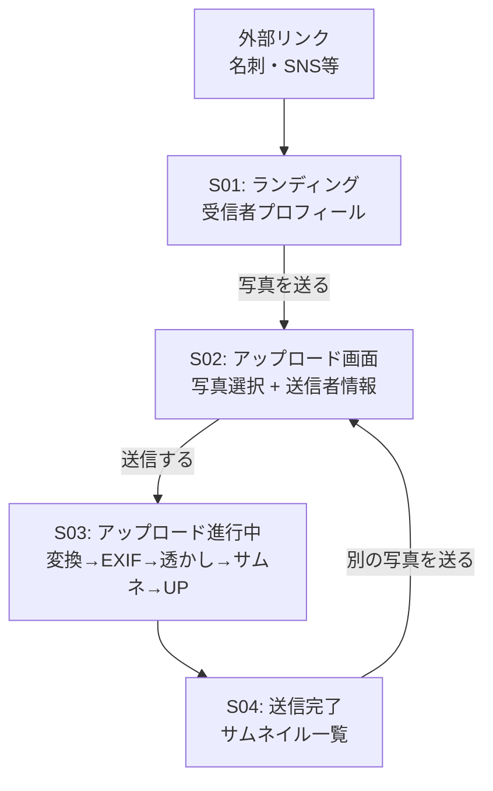
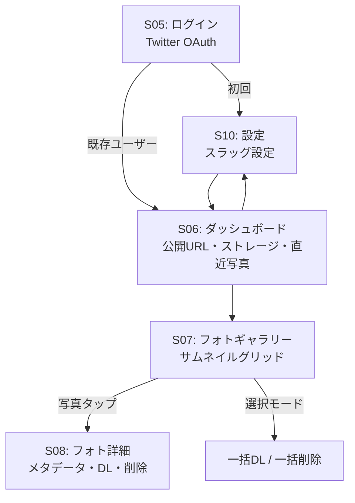
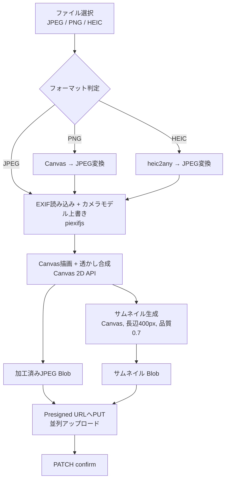

# 画面フロー・UX設計書 - image-share

## 1. 画面一覧

| ID | 画面名 | パス | 認証 | 説明 |
|---|---|---|---|---|
| S01 | 送信者ランディング | `/send/:handle` | 不要 | 受信者プロフィール + 「写真を送る」CTA |
| S02 | アップロード画面 | `/send/:handle/upload` | 不要 | 写真選択 + 送信者情報入力 + プレビュー |
| S03 | アップロード進行中 | `/send/:handle/uploading` | 不要 | 処理・アップロード進捗表示 |
| S04 | 送信完了 | `/send/:handle/done` | 不要 | 完了メッセージ + サムネイル一覧 |
| S05 | ログイン | `/login` | 不要 | Twitter OAuth等 |
| S06 | ダッシュボード | `/dashboard` | 必要 | 公開URL・ストレージ状況・直近写真 |
| S07 | フォトギャラリー | `/gallery` | 必要 | サムネイルグリッド + 選択・フィルタ |
| S08 | フォト詳細 | `/gallery/:photoId` | 必要 | 拡大表示 + メタデータ + DL・削除 |
| S10 | 設定 | `/settings` | 必要 | プロフィール・ストレージ管理 |

---

## 2. ナビゲーションフロー

### 送信者フロー（匿名）



### 受信者フロー（認証済）



---

## 3. 送信者フロー詳細

### S01: 送信者ランディング

```
+-----------------------------+
|  [受信者アイコン]           |
|  太郎カメラ                 |
|                             |
|  「写真を太郎カメラさんに   |
|   送れます」                |
|                             |
|  [  写真を送る  ] (CTA)    |
|                             |
|  ----                       |
|  image-share | Privacy      |
+-----------------------------+
```

- API: `GET /send/:handle` で受信者情報取得
- ハンドルが存在しない場合は404ページ表示
- クォータ超過時はCTAを非活性にしてメッセージ表示

### S02: アップロード画面

```
+-----------------------------+
|  < 戻る    太郎カメラさんへ |
|                             |
|  +-------------------------+|
|  |  ここにドラッグ&ドロップ ||
|  |  またはタップして選択    ||
|  |  (JPEG, 最大20MB/枚)   ||
|  +-------------------------+|
|                             |
|  [サムネイルグリッド]       |
|  [img][img][img][img]       |
|  [img][img]  各サムネにx    |
|                             |
|  v 詳細設定 (アコーディオン)|
|  +-------------------------+|
|  | 名前/TwitterID:         ||
|  | [@_________]            ||
|  |                         ||
|  | カメラモデル:            ||
|  | [___________]           ||
|  | *EXIFに書き込まれます    ||
|  |                         ||
|  | 透かし:                  ||
|  | テキスト [__________]   ||
|  | 位置  [9分割グリッド]   ||
|  | サイズ [---o------]     ||
|  | 透明度 [------o---]     ||
|  +-------------------------+|
|                             |
|  [    送信する (6枚)    ]   |
+-----------------------------+
```

**コンポーネント構成:**
```
UploaderPage
  +-- FileDropZone          // ドラッグ&ドロップ / ファイルピッカー
  +-- PhotoPreviewGrid      // サムネイルプレビュー (個別削除可)
  +-- SenderInfoForm        // 折りたたみ式
  |     +-- SenderNameField
  |     +-- CameraModelField
  |     +-- WatermarkSettings
  |           +-- WatermarkTextInput
  |           +-- WatermarkPositionGrid  // 9分割
  |           +-- WatermarkSizeSlider
  |           +-- WatermarkOpacitySlider
  +-- SubmitButton
```

**動作:**
- ファイル選択後、即座にCanvas APIでサムネイルプレビュー生成
- 透かし設定変更時、プレビューにリアルタイム反映
- accept属性: `image/jpeg,image/png,image/heic`
- PNG→JPEG: Canvas APIで即座に変換（軽量）
- HEIC→JPEG: `heic2any` を dynamic import（iOS向け）。変換中は「HEIC画像を変換中...少し時間がかかります」とスピナー表示
- ファイルサイズ20MB超はクライアント側でバリデーション拒否
- ファイル未選択時は送信ボタンdisabled

### S03: アップロード進行中

```
+-----------------------------+
|                             |
|  送信中...                  |
|                             |
|  [============----] 65%     |
|                             |
|  1. EXIF書き換え中...   [v] |
|  2. 透かし適用中...     [v] |
|  3. サムネイル生成中... [v] |
|  4. アップロード中  3/6 [.] |
|                             |
|  IMG_0042.JPG  [完了]       |
|  IMG_0043.JPG  [完了]       |
|  IMG_0044.JPG  [送信中...]  |
|  IMG_0045.JPG  [待機]       |
|  IMG_0046.JPG  [待機]       |
|  IMG_0047.JPG  [待機]       |
|                             |
+-----------------------------+
```

**処理パイプライン:**
1. EXIF書き換え（piexifjs）
2. 透かし適用（Canvas 2D API）
3. サムネイル生成（Canvas API, 長辺400px, 品質0.7）
4. アップロード（Presigned URLへPUT、並列実行）
5. 確認（PATCH confirm）

- `beforeunload` でページ離脱防止
- エラー発生時: 該当ファイルに「リトライ」ボタン表示
- 並列アップロードは `Promise.allSettled` で部分失敗に対応

### S04: 送信完了

```
+-----------------------------+
|                             |
|       [チェックアイコン]    |
|  6枚の写真を送信しました！  |
|                             |
|  [thumb][thumb][thumb]      |
|  [thumb][thumb][thumb]      |
|                             |
|  [ 別の写真を送る ]        |
|                             |
+-----------------------------+
```

- サムネイルはクライアント側で保持したBlob URLを表示
- ページリロード時はS01へリダイレクト（セッション永続化不要）
- 「別の写真を送る」→ S02へ（同じ受信者への再送）

---

## 4. 受信者フロー詳細

### S05: ログイン

```
+-----------------------------+
|                             |
|     [image-share ロゴ]      |
|                             |
|  写真を受け取るための       |
|  あなた専用URLを作ろう      |
|                             |
|  [  Twitterでログイン  ]    |
|  [  Googleでログイン   ]    |
|                             |
|  利用規約 | プライバシー    |
+-----------------------------+
```

- Firebase Auth `signInWithPopup`
- 初回ログイン → `/settings` でスラッグ設定を促す
- 既存ユーザー → `/dashboard` へリダイレクト

### S06: ダッシュボード

```
+-----------------------------+
|  image-share    [@] [設定]  |
|-----------------------------|
|                             |
|  あなたの受信URL:           |
|  image-share.dev/send/taro  |
|  [コピー] [QR] [シェア]    |
|                             |
|-----------------------------|
|                             |
|  ストレージ                 |
|  [=====-----] 2.3GB / 10GB |
|                             |
|-----------------------------|
|                             |
|  最近の写真                 |
|  [thumb] [thumb] [thumb]    |
|           全て見る >        |
|                             |
+-----------------------------+
```

**コンポーネント構成:**
```
DashboardPage
  +-- PublicUrlCard
  |     +-- CopyButton        // Clipboard API
  |     +-- QrCodeButton      // qrcode ライブラリ
  |     +-- ShareButton       // Web Share API / Twitter Intent
  +-- StorageQuotaBar
  |     // 80%超: 黄色, 95%超: 赤
  +-- RecentPhotosPreview     // 直近3枚のサムネイル
```

### S07: フォトギャラリー

```
+-----------------------------+
|  < 戻る  ギャラリー [選択]  |
|-----------------------------|
|  並び替え [v] | フィルタ [v]|
|-----------------------------|
|                             |
|  [thumb] [thumb] [thumb]    |
|  @user1  @user2  @user3    |
|  [thumb] [thumb] [thumb]    |
|  @user1         @user4     |
|  [thumb] [thumb]            |
|                             |
|       (スクロールで追加)    |
+-----------------------------+

--- 選択モード時 ---
+-----------------------------+
|  全選択 | 解除      [完了]  |
|-----------------------------|
|  [v][thumb] [ ][thumb] ...  |
|-----------------------------|
|  3枚選択中                  |
|  [DL] [削除]               |
+-----------------------------+
```

**レイアウト:**
- モバイル: 2カラム
- タブレット: 3カラム
- デスクトップ: 4-5カラム
- Intersection Observerで無限スクロール
- カーソルベースページネーション（50件/リクエスト）

**選択モード:**
- 右上「選択」トグルで切替
- チェックボックス表示
- 下部にアクションバー（DL / 削除）
- 一括DL: 各写真のPresigned URLを取得し、順次`<a download>` でDL

### S08: フォト詳細

```
+-----------------------------+
|  < 戻る           [DL] [x] |
|-----------------------------|
|                             |
|  +-------------------------+|
|  |                         ||
|  |   [サムネイル拡大表示]  ||
|  |                         ||
|  +-------------------------+|
|                             |
|  送信者: @hanako_photo      |
|  カメラ: Canon EOS R5       |
|  ファイル: IMG_0042.JPG     |
|  サイズ: 9.0 MB             |
|  解像度: 6000 x 4000       |
|  受信日: 2026/04/10 15:30  |
|                             |
|  [オリジナルをダウンロード] |
|  [削除] (確認ダイアログ)    |
+-----------------------------+
```

- サムネイルを拡大表示（オリジナルはDLボタン経由）
- 前後ナビゲーション（矢印キー対応）
- 削除は確認ダイアログ付き

---

## 5. クライアントサイド処理

### 5.1 処理パイプライン



### 5.2 サムネイル生成

```javascript
async function generateThumbnail(file) {
  const bitmap = await createImageBitmap(file, {
    imageOrientation: 'from-image'  // EXIF回転を自動適用
  });
  const maxSize = 400;
  const scale = Math.min(maxSize / bitmap.width, maxSize / bitmap.height, 1);
  const w = Math.round(bitmap.width * scale);
  const h = Math.round(bitmap.height * scale);
  const canvas = new OffscreenCanvas(w, h);
  const ctx = canvas.getContext('2d');
  ctx.drawImage(bitmap, 0, 0, w, h);
  return canvas.convertToBlob({ type: 'image/jpeg', quality: 0.7 });
}
```

- OffscreenCanvas対応ブラウザはWeb Worker内で処理（UIブロック回避）
- Safari非対応時はメインスレッドのCanvas要素でフォールバック

### 5.3 EXIF カメラモデル上書き

ライブラリ: `piexifjs`

```javascript
import piexif from 'piexifjs';

async function overwriteExifCameraModel(file, cameraModel) {
  const dataUrl = await fileToDataUrl(file);
  let exifObj;
  try {
    exifObj = piexif.load(dataUrl);
  } catch {
    exifObj = { '0th': {}, 'Exif': {}, 'GPS': {} };
  }
  if (cameraModel) {
    exifObj['0th'][piexif.ImageIFD.Model] = cameraModel;
  }
  const exifBytes = piexif.dump(exifObj);
  const newDataUrl = piexif.insert(exifBytes, dataUrl);
  return dataUrlToBlob(newDataUrl);
}
```

### 5.4 透かし (ウォーターマーク)

Canvas 2D APIで直接描画。外部ライブラリ不要。

**設定パラメータ:**

| パラメータ | デフォルト | 選択肢 |
|---|---|---|
| テキスト | (空) | 自由入力 |
| 位置 | 右下 | 9分割グリッド |
| サイズ | 長辺の2% | スライダー (1%-5%) |
| 透明度 | 50% | スライダー (10%-100%) |
| 色 | 白 (影付き) | 白 / 黒 |

```javascript
function applyWatermark(canvas, ctx, options) {
  const { text, position, fontSizeRatio, opacity, color } = options;
  if (!text) return;
  const fontSize = Math.round(
    Math.max(canvas.width, canvas.height) * fontSizeRatio
  );
  ctx.save();
  ctx.globalAlpha = opacity;
  ctx.font = `bold ${fontSize}px sans-serif`;
  ctx.fillStyle = color;
  // アウトライン (視認性確保)
  ctx.strokeStyle = color === '#ffffff' ? '#000000' : '#ffffff';
  ctx.lineWidth = fontSize * 0.1;
  const { x, y } = calcPosition(canvas, text, fontSize, position);
  ctx.strokeText(text, x, y);
  ctx.fillText(text, x, y);
  ctx.restore();
}
```

---

## 6. PWA設定

> **Note:** PWA実装はtabishareプロジェクトの実装を参考にする。

### Service Worker戦略

| リソース | キャッシュ戦略 |
|---|---|
| App Shell (HTML/CSS/JS) | Cache First |
| APIレスポンス | Network First |
| サムネイル画像 | Stale While Revalidate |
| オリジナル画像 | キャッシュしない |

### manifest.json

```json
{
  "name": "image-share",
  "short_name": "image-share",
  "display": "standalone",
  "start_url": "/dashboard",
  "theme_color": "#1a1a2e",
  "background_color": "#ffffff",
  "icons": [
    { "src": "/icons/icon-192.png", "sizes": "192x192", "type": "image/png" },
    { "src": "/icons/icon-512.png", "sizes": "512x512", "type": "image/png" }
  ]
}
```

### インストールプロンプト

- 受信者: ダッシュボード初回表示から30秒後にバナー表示
- 送信者: 送信完了画面でインラインバナー
- iOS Safari: 手動「ホーム画面に追加」の手順を案内

---

## 7. フィードバック・不具合報告

全画面のフッターに「フィードバック・不具合報告」リンクを設置。

- リンク先: Googleフォーム（メールアドレス収集OFF → 双方匿名）
- フォーム項目:
  - 種別: 不具合報告 / 機能要望 / その他（ラジオボタン）
  - 内容（自由記述、必須）
  - スクリーンショット（任意、ファイル添付）
- フッターコンポーネント `AppFooter` に配置、全ページで共通表示
