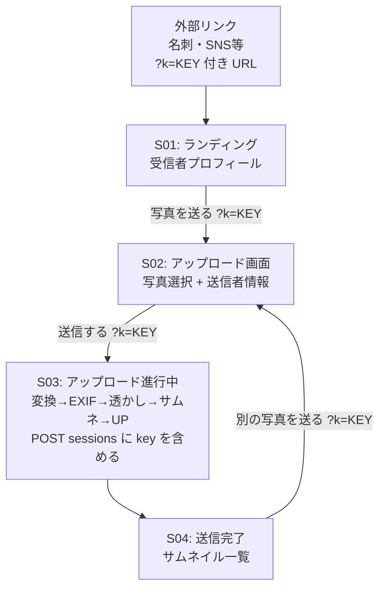
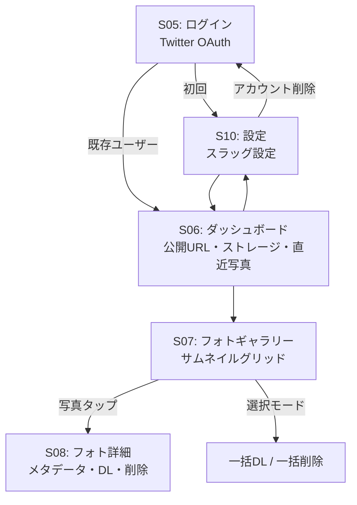
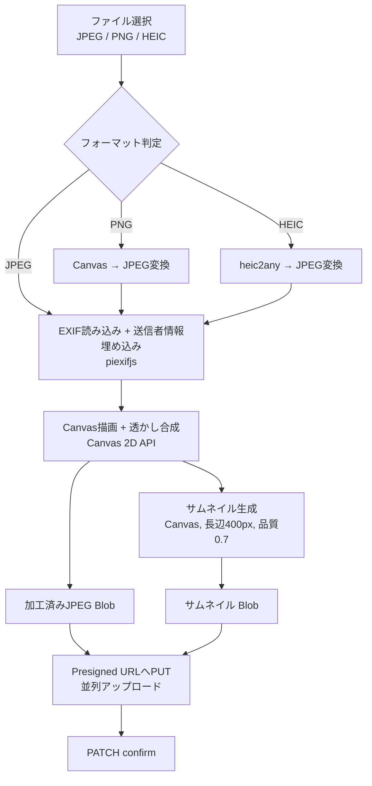

# 画面フロー・UX設計書 - FurDrop

## 1. 画面一覧

| ID | 画面名 | パス | 認証 | 説明 |
|---|---|---|---|---|
| S01 | 送信者ランディング | `/send/:handle?k=KEY` | 不要 | 受信者プロフィール + 「写真を送る」CTA。`?k=` (R16) は後続ページに引き回す |
| S02 | アップロード画面 | `/send/:handle/upload?k=KEY` | 不要 | 写真選択 + 送信者情報入力 + プレビュー |
| S03 | アップロード進行中 | `/send/:handle/uploading?k=KEY` | 不要 | 処理・アップロード進捗表示。`POST .../sessions` に `key` を含めて送信 |
| S04 | 送信完了 | `/send/:handle/done?k=KEY` | 不要 | 完了メッセージ + サムネイル一覧 |
| S05 | ログイン | `/login` | 不要 | Twitter OAuth等 |
| S06 | ダッシュボード | `/dashboard` | 必要 | 公開URL・ストレージ状況・直近写真 |
| S07 | フォトギャラリー | `/gallery` | 必要 | サムネイルグリッド + 選択・フィルタ |
| S08 | フォト詳細 | `/gallery/:photoId` | 必要 | 拡大表示 + メタデータ + DL・削除 |
| S10 | 設定 | `/settings` | 必要 | プロフィール・ストレージ管理・受信オプション・通知設定・アカウント削除 |
| S11 | 利用規約 | `/terms` | 不要 | `frontend/src/content/legal/terms.md` を react-markdown でレンダリング |
| S12 | プライバシーポリシー | `/privacy` | 不要 | `frontend/src/content/legal/privacy.md` を react-markdown でレンダリング |

### 全画面共通のクエリパラメータ

| クエリ | 用途 |
|---|---|
| `?lang=ja` / `?lang=en` | 表示言語の指定。E2E での固定とサポート時の再現用。一度指定すると localStorage に保存され、以降クエリ無しでも維持される |
| `?debug=true` / `?debug=false` | 送信パイプラインの詳細ログ出力。同じく sticky |

言語の決定順は `?lang=` → localStorage → `navigator.languages` → `en`。
ヘッダーの言語トグルからも切り替えられる。

### 英語 OGP 用の入口 `/en/`

広告のリンク先に使う静的ページ (`frontend/en/index.html`)。OGP を読む X / Meta の
クローラーは JS を実行しないため、SPA 側で言語を切り替えても静的なタグは日本語のまま
届く。閲覧者の言語では出し分けられないので URL で出し分ける。

- クローラー: 英語の `og:*` / `twitter:*` と `og-en.png` を読んで帰る
- 人間: `<script>` で `/?lang=en` へ転送される (`_redirects` の 301/302 にすると
  クローラーも転送されてしまうので JS で行う)
- `noindex`。検索向けの `/en/` 配下ルーティングと hreflang は v1.1

OG 画像は `python3 frontend/scripts/generate-og.py` で日英ぶん生成する
(`public/og.png` / `public/og-en.png`)。

---

## 2. ナビゲーションフロー

### 送信者フロー（匿名）

`?k=KEY` (R16 アクセスキー) は S01〜S04 の全ページで URL に保持される。Link/navigate ヘルパー `withKey()` がパス間を引き回す。`POST /send/:handle/sessions` で初めてサーバが検証。

受信者がキーを opt-out している場合は受信URLに `?k=` が付かない。S03 は `?k=` が無いとき `GET /send/:handle` の `require_send_key` を見て判断し、キー必須の受信者に対してのみ写真の加工前にエラーで止める。


```mermaid
flowchart TD
    EXT[外部リンク<br/>名刺・SNS等<br/>?k=KEY 付き URL] --> S01[S01: ランディング<br/>受信者プロフィール]
    S01 -->|写真を送る ?k=KEY| S02[S02: アップロード画面<br/>写真選択 + 送信者情報]
    S02 -->|送信する ?k=KEY| S03[S03: アップロード進行中<br/>変換→EXIF→透かし→サムネ→UP<br/>POST sessions に key を含める]
    S03 --> S04[S04: 送信完了<br/>サムネイル一覧]
    S04 -->|別の写真を送る ?k=KEY| S02
```

### 受信者フロー（認証済）


```mermaid
flowchart TD
    S05[S05: ログイン<br/>Twitter OAuth] -->|初回| S10[S10: 設定<br/>スラッグ設定]
    S05 -->|既存ユーザー| S06[S06: ダッシュボード<br/>公開URL・ストレージ・直近写真]
    S10 --> S06
    S06 --> S07[S07: フォトギャラリー<br/>サムネイルグリッド]
    S06 --> S10
    S07 -->|写真タップ| S08[S08: フォト詳細<br/>メタデータ・DL・削除]
    S07 -->|選択モード| BATCH[一括DL / 一括削除]
    S10 -->|アカウント削除| S05
```

---

## 3. 送信者フロー詳細

### S01: 送信者ランディング

```
+-----------------------------+
|  [受信者アイコン]           |
|  太郎カメラ                 |
|                             |
|  「写真を太郎カメラさんに   |
|   送れます」                |
|                             |
|  [  写真を送る  ] (CTA)    |
|                             |
|  ----                       |
|  FurDrop | Privacy      |
+-----------------------------+
```

- URL: `/send/:handle?k=KEY` — `?k=` は R16 アクセスキー。ランディング表示自体はキーなしでも 200 を返すが、`?k=` を持っていないと S02 → S03 のセッション作成で 403 になる
- API: `GET /send/:handle` で受信者情報取得（このエンドポイントは `k` を検証しない、プロフィールは公開情報）
- ハンドルが存在しない場合は404ページ表示
- 受け付けていないときは理由で文言を出し分ける (`unavailable_reason`)。
  `paused` は「受け付けていません」、`full` は「保存容量がいっぱいです。空きを作ってもらうよう伝えてください」。
  同じ「送れない」でも送信者が取れる行動が違うため
- 「写真を送る」リンクは `?k=` を URL から読み取って S02 にそのまま引き継ぐ（`withKey(path, key)` ヘルパー）

### S02: アップロード画面

```
+-----------------------------+
|  < 戻る    太郎カメラさんへ |
|                             |
|  +-------------------------+|
|  |  ここにドラッグ&ドロップ ||
|  |  またはタップして選択    ||
|  |  (JPEG, 最大20MB/枚)   ||
|  +-------------------------+|
|                             |
|  [サムネイルグリッド]       |
|  [img][img][img][img]       |
|  [img][img]  各サムネにx    |
|                             |
|  v 詳細設定 (アコーディオン)|
|  +-------------------------+|
|  | 名前/TwitterID:         ||
|  | [@_________]            ||
|  |                         ||
|  | ※以下は受信者が許可した ||
|  |  オプションのみ表示(R14)||
|  |                         ||
|  | EXIF埋め込み:            ||
|  | [___________]           ||
|  | *カメラモデル欄に書込    ||
|  | *元のカメラ情報は上書き  ||
|  |                         ||
|  | 透かし: [x] 入れる       ||
|  | [ 透かしを編集 ]         ||
|  | → 編集ダイアログで       ||
|  |   ドラッグ配置・複数要素 ||
|  +-------------------------+|
|                             |
|  [    送信する (6枚)    ]   |
+-----------------------------+
```

**コンポーネント構成:**
```
UploaderPage
  +-- FileDropZone          // ドラッグ&ドロップ / ファイルピッカー
  +-- PhotoPreviewGrid      // サムネイルプレビュー (個別削除可)
  +-- SenderInfoForm        // 折りたたみ式
  |     +-- SenderNameField
  |     +-- ExifEmbedField        // EXIF送信者情報埋め込み
  |     +-- WatermarkToggle          // 「透かしを入れる」+「透かしを編集」ボタン
  +-- WatermarkDialog                // 透かし編集ダイアログ (§5.4 参照)
  |     +-- PreviewCanvas            // 実写真プレビュー + 要素ドラッグ + ズーム
  |     +-- CandidateSelector        // プレビュー画像の切替 (縦横比混在時は注意表示)
  |     +-- ElementChips             // 要素の選択・追加 (文字/四角形、合計最大5)
  |     +-- ElementEditor            // text: テキスト/フォント/サイズ/縁取り、rect: 幅/高さ/角丸。共通: 透明度/色/削除
  +-- SubmitButton
```

**動作:**
- ファイル選択後、即座にCanvas APIでサムネイルプレビュー生成
- 透かし設定変更時、プレビューにリアルタイム反映
- accept属性: `image/jpeg,image/png,image/heic`
- PNG→JPEG: Canvas APIで即座に変換（軽量）
- HEIC→JPEG: `heic2any` を dynamic import（iOS向け）。変換中は「HEIC画像を変換中...少し時間がかかります」とスピナー表示
- ファイルサイズ20MB超はクライアント側でバリデーション拒否
- ファイル未選択時は送信ボタンdisabled
- 送信者名が必須になる条件 (R14): 受信者が `require_sender_name` を有効化、または EXIF埋め込みが `required`。該当時は名前ラベルに「必須」バッジが付き、未入力では送信不可 (名前なし同意チェックは非表示)
- 「透かしを入れる」を手動でONにすると編集ダイアログが自動で開く (何がどこに焼き込まれるかをその場で確認させる)。required による自動ONでは開かない

### S03: アップロード進行中

```
+-----------------------------+
|                             |
|  送信中...                  |
|                             |
|  [============----] 65%     |
|                             |
|  1. EXIF書き換え中...   [v] |
|  2. 透かし適用中...     [v] |
|  3. サムネイル生成中... [v] |
|  4. アップロード中  3/6 [.] |
|                             |
|  IMG_0042.JPG  [完了]       |
|  IMG_0043.JPG  [完了]       |
|  IMG_0044.JPG  [送信中...]  |
|  IMG_0045.JPG  [待機]       |
|  IMG_0046.JPG  [待機]       |
|  IMG_0047.JPG  [待機]       |
|                             |
+-----------------------------+
```

**処理パイプライン:**
1. EXIF書き換え（piexifjs）
2. 透かし適用（Canvas 2D API）
3. サムネイル生成（Canvas API, 長辺400px, 品質0.7）
4. アップロード（Presigned URLへPUT、並列実行）
5. 確認（PATCH confirm）

- `beforeunload` でページ離脱防止
- エラー発生時: 該当ファイルに「リトライ」ボタン表示
- 並列アップロードは `Promise.allSettled` で部分失敗に対応

### S04: 送信完了

```
+-----------------------------+
|                             |
|       [チェックアイコン]    |
|  6枚の写真を送信しました！  |
|                             |
|  [thumb][thumb][thumb]      |
|  [thumb][thumb][thumb]      |
|                             |
|  [ 別の写真を送る ]        |
|                             |
+-----------------------------+
```

- サムネイルはクライアント側で保持したBlob URLを表示
- ページリロード時はS01へリダイレクト（セッション永続化不要）。URL の `?k=` も継承する
- 「別の写真を送る」→ S02へ（同じ受信者への再送、`?k=` 継承）

---

## 4. 受信者フロー詳細

### S05: ログイン

```
+-----------------------------+
|                             |
|     [FurDrop ロゴ]      |
|                             |
|  写真を受け取るための       |
|  あなた専用URLを作ろう      |
|                             |
|  [  Twitterでログイン  ]    |
|  [  Googleでログイン   ]    |
|                             |
|  利用規約 | プライバシー    |
+-----------------------------+
```

- Firebase Auth `signInWithPopup`
- 初回ログイン → `/settings` でスラッグ設定を促す
- 既存ユーザー → `/dashboard` へリダイレクト

### S06: ダッシュボード

```
+-----------------------------+
|  FurDrop    [@] [設定]  |
|-----------------------------|
|                             |
|  あなたの受信URL:           |
|  furdrop.dev/send/taro      |
|     ?k=V1StGXR8_Z5...       |   ← R16 アクセスキー付き
|  [コピー] [QR] [シェア]    |
|                             |
|-----------------------------|
|                             |
|  ストレージ                 |
|  [=====-----] 2.3GB / 10GB |
|                             |
|-----------------------------|
|                             |
|  最近の写真                 |
|  [thumb] [thumb] [thumb]    |
|           全て見る >        |
|                             |
+-----------------------------+
```

**コンポーネント構成:**
```
DashboardPage
  +-- QuotaWarning             // 使用率 80% 以上で警告 / 95% 以上でエラー (R07)
  +-- ExpiryWarning            // 60日以内に期限を迎える写真の予告 (R13)
  +-- PublicUrlCard            // user.receive_url を origin と結合して表示 (受付停止中は注意を出す)
  |     +-- CopyButton        // Clipboard API
  |     +-- QrCodeButton      // qrcode ライブラリ
  |     +-- ShareButton       // Web Share API / Twitter Intent
  +-- StorageQuotaBar
  |     // 80%超: 黄色, 95%超: 赤
  +-- RecentPhotosPreview     // 直近3枚のサムネイル
```

`user.receive_url` は Workers の `/auth/me` が組み立てて返す。`require_send_key` が有効なら `send_keys` の最古のキー 1 件を `?k=KEY` として付け、opt-out 中は付けずに素の `/send/:handle` を返す (R16)。フロント側はキーの有無を意識せず、コピー・QR・シェアはすべて `receive_url` に追従する。

### S07: フォトギャラリー

```
+-----------------------------+
|  < 戻る  ギャラリー [選択]  |
|-----------------------------|
|  並び替え [v] | フィルタ [v]|
|-----------------------------|
|                             |
|  [thumb] [thumb] [thumb]    |
|  @user1  @user2  @user3    |
|  [thumb] [thumb] [thumb]    |
|  @user1         @user4     |
|  [thumb] [thumb]            |
|                             |
|       (スクロールで追加)    |
+-----------------------------+

--- 選択モード時 ---
+-----------------------------+
|  全選択 | 解除      [完了]  |
|-----------------------------|
|  [v][thumb] [ ][thumb] ...  |
|-----------------------------|
|  3枚選択中                  |
|  [DL] [削除]               |
+-----------------------------+
```

**削除予告バッジ (R13):**
- 残り 14 日以内の写真だけ、サムネイル右下に「残りN日」のピルを重ねる (残り 3 日以内は Rust)
- 左上は選択モードのチェックボックスが占めるため右下に置く
- 全件に出すと視覚ノイズになるので、期限が遠い写真には出さない

**レイアウト:**
- モバイル: 2カラム
- タブレット: 3カラム
- デスクトップ: 4-5カラム
- Intersection Observerで無限スクロール
- カーソルベースページネーション（50件/リクエスト）

**選択モード:**
- 右上「選択」トグルで切替
- チェックボックス表示
- 下部にアクションバー（DL / 削除）
- 一括DL: 各写真のPresigned URLを取得し、順次`<a download>` でDL

### S08: フォト詳細

```
+-----------------------------+
|  < 戻る           [DL] [x] |
|-----------------------------|
|                             |
|  +-------------------------+|
|  |                         ||
|  |   [サムネイル拡大表示]  ||
|  |                         ||
|  +-------------------------+|
|                             |
|  送信者: @hanako_photo      |
|  ファイル: IMG_0042.JPG     |
|  サイズ: 9.0 MB             |
|  解像度: 6000 x 4000       |
|  受信日: 2026/04/10 15:30  |
|  削除予定日: 2027/04/10     |
|                             |
|  [オリジナルをダウンロード] |
|  [削除] (確認ダイアログ)    |
+-----------------------------+
```

- 削除予定日は常時表示。残り 60 日以内なら Amber + 「(あとN日)」を添える (R13)
- サムネイルを拡大表示（オリジナルはDLボタン経由）
- 前後ナビゲーション（矢印キー対応）
- 削除は確認ダイアログ付き

### S10: 設定

プロフィール表示、受信オプション、ストレージ使用状況、アカウント削除を 1 ページに集約。

```
+-----------------------------+
|  設定                       |
|-----------------------------|
|  [プロフィール]             |
|  ハンドル: taro_camera      |
|  表示名: 太郎カメラ         |
|-----------------------------|
|  [写真の受付]               |
|  [x] 写真を受け付ける       |
|  [x] 受信URLを知っている人  |
|      だけから受け取る       |
|      ↑オフ時のみ確認ダイアログ|
|-----------------------------|
|  [受信オプション]           |
|  [x] 送信者名の入力を必須に |
|  EXIF埋め込み:              |
|   [無効][任意][必須]        |
|  透かし:                    |
|   [無効][任意][必須]        |
|-----------------------------|
|  [ストレージ]               |
|  [=====-----] 2.3GB / 10GB |
|  ※写真は365日で自動削除     |
|-----------------------------|
|  [アカウント削除]           |
|  アカウントと全データを     |
|  完全に削除します。         |
|  この操作は取り消せません。 |
|  [ アカウントを削除 ]      |   ← danger ボタン
+-----------------------------+

--- 削除確認ダイアログ ---
+-----------------------------+
|  アカウントを削除しますか？ |
|-----------------------------|
|  以下のデータが完全に       |
|  削除されます:              |
|   ・全ての写真とサムネイル  |
|   ・プロフィール・設定      |
|   ・公開URL の所有権        |
|                             |
|  ※ 法令遵守のため、送信者の |
|  通信記録 (IP・UA) は最低   |
|  3か月の保存期間を経過する  |
|  まで残ります (規約13条)。 |
|                             |
|  続行するには、ご自身の     |
|  ハンドルを入力してください |
|  [taro_camera_____]         |
|                             |
|  [キャンセル] [削除する]    |   ← ハンドル一致で活性
+-----------------------------+
```

**写真の受付 (R11 / R16 opt-out):**

- 「写真を受け付ける」= `users.is_active`。オフにすると S01 で受付停止中と表示され、送信は 403 になる
- 「受信URLを知っている人だけから受け取る」= `users.require_send_key`。**オフにするときだけ**確認ダイアログを出し、「ハンドルを知っている人なら誰でも送れる状態になる」「意図しない写真が届いたら受付をオフにすれば止められる」「元に戻せば同じ受信URLが使える」の3点を提示する
- オフの間はダッシュボードの受信URLが `?k=` 無しの短い URL に切り替わる (コピー・QR・シェアはすべて `receive_url` 由来なので自動追従)

**削除フロー (R15):**
1. ダイアログでハンドル再入力 → 一致で削除ボタン活性
2. `DELETE /auth/account` 呼び出し → サーバ側で D1 (photos / users 全削除、upload_sessions は保存期間=100日経過済みのみ削除) + R2 オブジェクトを削除
3. クライアントで Firebase `deleteUser()` を best-effort 実行
4. `signOut()` してローカル状態クリア → `/login` へ遷移
5. Firebase 削除に失敗（`requires-recent-login` 等）しても Workers データは消えており、再ログイン時に `/auth/me` が 404 を返し登録画面に流れる自然なリカバリで吸収される
6. 保存期間中のため残された孤児セッションは Cron `cleanupOrphanedSessions` が 100日経過後に物理削除する

---

## 5. クライアントサイド処理

### 5.1 処理パイプライン


```mermaid
flowchart TD
    A[ファイル選択<br/>JPEG / PNG / HEIC] --> B{フォーマット判定}
    B -->|JPEG| D[EXIF読み込み + 送信者情報埋め込み<br/>piexifjs]
    B -->|PNG| C1[Canvas → JPEG変換]
    B -->|HEIC| C2[heic2any → JPEG変換]
    C1 --> D
    C2 --> D
    D --> E[Canvas描画 + 透かし合成<br/>Canvas 2D API]
    E --> F[加工済みJPEG Blob]
    E --> G[サムネイル生成<br/>Canvas, 長辺400px, 品質0.7]
    G --> H[サムネイル Blob]
    F --> I[Presigned URLへPUT<br/>並列アップロード]
    H --> I
    I --> J[PATCH confirm]
```

### 5.2 サムネイル生成

```javascript
async function generateThumbnail(file) {
  const bitmap = await createImageBitmap(file, {
    imageOrientation: 'from-image'  // EXIF回転を自動適用
  });
  const maxSize = 400;
  const scale = Math.min(maxSize / bitmap.width, maxSize / bitmap.height, 1);
  const w = Math.round(bitmap.width * scale);
  const h = Math.round(bitmap.height * scale);
  const canvas = new OffscreenCanvas(w, h);
  const ctx = canvas.getContext('2d');
  ctx.drawImage(bitmap, 0, 0, w, h);
  return canvas.convertToBlob({ type: 'image/jpeg', quality: 0.7 });
}
```

- OffscreenCanvas対応ブラウザはWeb Worker内で処理（UIブロック回避）
- Safari非対応時はメインスレッドのCanvas要素でフォールバック

### 5.3 EXIF 送信者情報埋め込み

送信者が入力したテキストをEXIFのカメラモデルフィールド（`IFD0.Model`）に書き込む。
元のカメラモデル情報は上書きされる。送信者がこの方式で情報を残すかは任意選択。

ライブラリ: `piexifjs`

```javascript
import piexif from 'piexifjs';

async function embedSenderInfoInExif(file, senderText) {
  const dataUrl = await fileToDataUrl(file);
  let exifObj;
  try {
    exifObj = piexif.load(dataUrl);
  } catch {
    exifObj = { '0th': {}, 'Exif': {}, 'GPS': {} };
  }
  if (senderText) {
    exifObj['0th'][piexif.ImageIFD.Model] = senderText;
  }
  const exifBytes = piexif.dump(exifObj);
  const newDataUrl = piexif.insert(exifBytes, dataUrl);
  return dataUrlToBlob(newDataUrl);
}
```

### 5.4 透かし (ウォーターマーク)

Canvas 2D APIで直接描画。外部ライブラリ不要。実装は `frontend/src/lib/watermark.ts`。

**モデル (複数要素のステッカー方式):**

テキストと四角形の要素を合計最大5個、プレビュー上のドラッグで自由配置する。

テキスト要素のパラメータ:

| パラメータ | デフォルト | 選択肢 |
|---|---|---|
| テキスト | 送信者名に連動 (autoText) | 自由入力 (改行可、編集で連動解除) |
| 位置 | 右下 | ドラッグで自由配置 (アンカー吸着方式、下記) |
| フォント | ゴシック (Noto Sans JP) | Google Fonts 日本語 24種 (定番 / 丸ゴ・ポップ / インパクト / 手書き・デザイン)。全て Web フォントで端末差なし。選択時に遅延ロード |
| サイズ | 長辺の2% | スライダー (0.5%-15%) |
| 透明度 | 80% | スライダー (10%-100%) |
| 色 | 白/黒 (自動) | パレット8種 (明/暗ペアを内蔵し、要素位置の背景輝度で自動選択) + カスタム固定色 |
| 縁取り | なし | フィル色の反対輝度色でアウトライン |

四角形要素 (文字を写真から浮かせる下地) のパラメータ:

| パラメータ | デフォルト | 選択肢 |
|---|---|---|
| 幅 / 高さ | 長辺の35% / 12% | スライダー (幅 5-100% / 高さ 2-60%) |
| 角丸 | 30% | スライダー (0%=直角 〜 100%=カプセル形) |
| 透明度 | 50% | スライダー (10%-100%) |
| 色 | 白 (固定・単色) | テキストと同じパレット (明暗自動) + カスタム固定色 |

- **四角形は常にテキストの背面に描画**する固定ルール (z 順の管理 UI を持たない)。テキストの自動色は描画済みの四角形の上をサンプリングするため、下地に対するコントラストが自動で決まる
- 四角形のクランプ余白は 0 (画像の端にぴったり付けて帯として敷ける)

**座標系 (アンカー吸着 + クランプ):**

- 要素の中心 = `anchor (0|0.5|1 の9点) × キャンバス寸法 + offset × 長辺`。offset を長辺比で持つことでフォントサイズと同じ単位でスケールし、縦横比の違う写真間でも「角からの見た目の余白」が保たれる
- ドラッグ確定時に最寄りアンカーとオフセットを再導出する。**近接グループ化ヒューリスティック**: bbox が重なる (近接する) 要素は union bbox で最寄りアンカーを共有し、相対配置を保つ
- 描画時は要素ごとに bbox を測り、写真ごとに**はみ出す分だけ内側へ押し戻す (クランプ常時ON)**。どの縦横比でも全文が写真内に収まる。クランプは要素単位で完全に独立しており、ある要素を端へ押し付けても他の要素は動かない (直接操作の予測可能性を優先。スペースが足りない写真では要素同士が重なり得るが、プレビュー確認に委ねる)
- セッション内の縦横比が混在する場合は、ダイアログ内に「サムネイルを切り替えて他の写真でも確認」のインライン注意を表示する

**永続化:**

- 要素配列は送信者名・EXIF設定とともに localStorage (`furdrop.uploadForm`) に永続化。リピート送信者は前回のデザインをそのまま使える
- 適用した透かしは `photos.watermark_text` に要素配列の JSON として記録される (記録用)

---

## 6. PWA設定

> **Note:** PWA実装はtabishareプロジェクトの実装を参考にする。

### Service Worker戦略

| リソース | キャッシュ戦略 |
|---|---|
| App Shell (HTML/CSS/JS) | Cache First |
| APIレスポンス | Network First |
| サムネイル画像 | Stale While Revalidate |
| オリジナル画像 | キャッシュしない |

### manifest.json

```json
{
  "name": "furdrop",
  "short_name": "furdrop",
  "display": "standalone",
  "start_url": "/dashboard",
  "theme_color": "#1a1a2e",
  "background_color": "#ffffff",
  "icons": [
    { "src": "/icons/icon-192.png", "sizes": "192x192", "type": "image/png" },
    { "src": "/icons/icon-512.png", "sizes": "512x512", "type": "image/png" }
  ]
}
```

### インストールプロンプト

- 受信者: ダッシュボード初回表示から30秒後にバナー表示
- 送信者: 送信完了画面でインラインバナー
- iOS Safari: 手動「ホーム画面に追加」の手順を案内

---

## 7. フィードバック・不具合報告

全画面のフッターに「フィードバック・不具合報告」リンクを設置。

- リンク先: Googleフォーム（メールアドレス収集OFF → 双方匿名）
- フォーム項目:
  - 種別: 不具合報告 / 機能要望 / その他（ラジオボタン）
  - 内容（自由記述、必須）
  - スクリーンショット（任意、ファイル添付）
- フッターコンポーネント `AppFooter` に配置、全ページで共通表示
